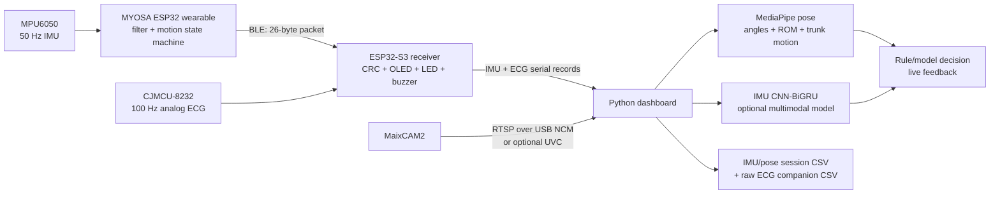

<div align="center">
  <h1>LiteRehab Fusion</h1>
  <p>Wearable IMU sensing, independent MaixCAM2 vision, and real-time upper-limb rehabilitation feedback.</p>
  <p>
    
    
    
    
  </p>
  <p><a href="README.md">English</a> · <a href="README_zh.md">中文</a></p>
</div>

LiteRehab Fusion is a BMEG3920 coursework and engineering prototype for upper-limb rehabilitation demonstrations. A MYOSA ESP32 wearable classifies forearm motion and sends 50 Hz MPU6050 samples over BLE to an ESP32-S3 receiver. A MaixCAM2 independently supplies video to a desktop Python dashboard, where MediaPipe pose features, optional neural-network inference, feedback fusion, visualization, and synchronized CSV logging run.

**LiteRehab Fusion is not a medical device. It does not diagnose, prescribe treatment, score recovery, or replace professional supervision.**

## Contents

- [System at a glance](#system-at-a-glance)
- [Architecture and data flow](#architecture-and-data-flow)
- [Runnable projects](#runnable-projects)
- [Quick start](#quick-start)
- [Operation and outputs](#operation-and-outputs)
- [Repository structure](#repository-structure)
- [Python project reference](#python-project-reference)
- [C project reference](#c-project-reference)
- [Build and verification](#build-and-verification)
- [Troubleshooting](#troubleshooting)
- [Documentation and safety](#documentation-and-safety)

## System at a glance

| Component | Current implementation | Status |
|---|---|---|
| Wearable sensing | MYOSA ESP32 + MPU6050, sampled every 20 ms (50 Hz) | Implemented |
| On-device motion logic | Filtering, adaptive thresholds, two exercise states, repetition count, and quality | Implemented |
| Wireless link | 26-byte versioned BLE notification with CRC-16 | Implemented |
| Receiver gateway | ESP32-S3 BLE central plus CJMCU-8232 ADC sampling and USB serial telemetry | Implemented |
| ECG sensing | CJMCU-8232 on GPIO4, sampled at 100 Hz with teammate-defined pulse/BPM-change logic | Implemented; demonstration only |
| Receiver display and feedback | SSD1306 status display, connection LED, and queued motion/ECG buzzer patterns | Implemented |
| Independent camera | MaixCAM2 RTSP over USB NCM by default; UVC optional | Implemented |
| Desktop vision | MediaPipe pose landmarks and derived joint/trunk features | Implemented |
| IMU model | Automatically loaded CNN-BiGRU checkpoint | Implemented |
| Multimodal model | Dual-branch CNN-BiGRU code and training pipeline | Optional; no default fusion checkpoint |
| Dashboard and logging | 1280×720 interface, ECG waveform, synchronized IMU/pose CSV, and companion ECG CSV | Implemented |

The firmware directly recognizes `forearm_rotation` and `elbow_flexion`. The shipped IMU checkpoint also contains `shoulder_abduction`, but that class is not a third firmware repetition state. The current model and dataset are classroom baselines, not clinical validation evidence.

## Architecture and data flow



The MaixCAM2 only replaces the video source. Pose estimation, IMU inference, multimodal inference, rule/model resolution, dashboard rendering, and CSV recording remain on the host computer.

### Runtime sequence

1. The lightweight wearable initializes I²C, finds the MPU6050, tolerates the intentionally absent wearable OLED, and calibrates gyroscope bias while stationary.
2. Every 20 ms it reads six-axis data, updates the motion state machine, finalizes a CRC-protected packet, and notifies the BLE receiver.
3. The receiver validates each packet, samples CJMCU-8232 GPIO4 at 100 Hz, updates the receiver OLED, serializes buzzer events, and prints separate `IMU,...` and `ECG,...` records.
4. The dashboard timestamps IMU, ECG, and camera arrival with the desktop monotonic clock.
5. MediaPipe extracts side-specific shoulder, elbow, wrist, and hip features when landmarks are visible.
6. The synchronizer matches each IMU sample to the nearest pose sample within 50 ms; missing vision stays explicit.
7. Rule warnings retain priority. A configured multimodal model may override normal rule output only when its confidence reaches the selected threshold.
8. The interface renders motion plus a rolling ECG waveform. IMU/pose samples retain the existing session CSV schema, while raw ECG records go to `<session>_ecg.csv` and never enter motion decisions.

## Runnable projects

The repository contains five distinct runnable or buildable units:

| Project | Language/runtime | Target | Main entry point | Purpose |
|---|---|---|---|---|
| Wearable firmware | C / ESP-IDF | MYOSA ESP32 (ESP32) | `wearable/main/app_main.c` | Read MPU6050, classify motion, count repetitions, and publish BLE packets; optional OLED support remains |
| Receiver firmware | C / ESP-IDF | ESP32-S3-DevKitC-1 | `receiver/main/app_main.c` | Receive BLE, sample ECG, update OLED/LED/buzzer, and forward IMU/ECG serial telemetry |
| Shared algorithms | Portable C17 | Host tests + firmware | `shared/*.c` | Define packet, motion, feedback, and teammate-compatible ECG threshold logic |
| Desktop application | Python 3.12 | macOS/Linux/Windows host | `python/run_dashboard.py` | Read IMU/ECG/video, render ECG and pose, run motion models, and write separate session/ECG CSVs |
| Camera application | MaixPy | MaixCAM2 | `maixcam2/main.py` | Publish the built-in camera as RTSP or optional USB UVC |

## Quick start

Run commands from the repository root unless a section says otherwise.

### 1. Hardware and wiring

| Quantity | Part | Role |
|---:|---|---|
| 1 | MYOSA ESP32 WROOM-32E | Wearable controller and BLE peripheral |
| 1 | MPU6050 | Six-axis forearm motion sensing |
| 1 | SSD1306 128×64 OLED | Receiver BLE, ECG, repetition, and quality display |
| 1 | ESP32-S3-DevKitC-1 N16R8 | BLE central and native-USB serial gateway |
| 1 | CJMCU-8232 plus three-electrode cable/pads | Receiver-side single-lead ECG waveform |
| 1 if needed | Four-pin JST-to-Dupont adapter | Connect the MYOSA OLED to receiver GPIO8/9/3V3/GND |
| 1 each | LED, 220–330 Ω resistor, passive buzzer | Receiver connection and exercise feedback |
| 1 | MaixCAM2 | Independent RTSP/UVC video source |
| 2–3 | Data-capable USB cables | Power, flashing, serial, and camera networking |

```text
Wearable I²C: MYOSA motherboard -> MPU6050 only; rigidly mount and restrain cable
Receiver LED: GPIO2 -> 220–330 Ω -> LED -> GND
Receiver buzzer: GPIO18 -> 100–330 Ω -> passive buzzer -> GND
Receiver OLED: GPIO8 SDA, GPIO9 SCL, 3V3, GND
Receiver ECG: GPIO4 OUTPUT, GPIO5 LO+, GPIO6 LO-, 3V3/GND, SDN -> 3V3
Host: ESP32-S3 native USB and MaixCAM2 Type-C use separate data cables
```

Disconnect power before wiring. Use 3.3 V for CJMCU-8232, keep GPIO19/20 for native USB, and do not use GPIO35–37 on the N16R8 board. See the [complete wiring guide](WIRING_GUIDE.md) before powering the boards or attaching electrodes.

### 2. Build and flash the ESP32 projects

The helper scripts use the local ESP-IDF 6.0.2 installation at `~/.espressif/v6.0.2/esp-idf`.

```bash
source ~/.espressif/v6.0.2/esp-idf/export.sh
./scripts/build_all.sh

./scripts/flash_wearable.sh /dev/cu.usbserial-WEARABLE
./scripts/flash_receiver.sh /dev/cu.usbmodem-RECEIVER
```

Replace the example device paths with the actual ports. Set `BAUD=115200` before a flash command if the ESP32-S3 native USB connection is unstable.

### 3. Create the desktop Python environment

Python 3.12 is recommended because the current requirements install MediaPipe only for Python versions below 3.13.

```bash
conda create -n literehab python=3.12 -y
conda activate literehab
python -m pip install -r python/requirements.txt
```

Core dependencies are NumPy, OpenCV, pyserial, MediaPipe, PyTorch, and pytest.

### 4. Start the MaixCAM2 video source

Connect MaixCAM2 with a data-capable Type-C cable. In MaixVision, open `maixcam2/main.py` and run the committed default:

```python
MODE = "rtsp"
```

The MaixVision terminal prints the actual stream URL. Over USB NCM it is commonly:

```text
rtsp://10.203.102.1:8554/live
```

For an optional local UVC device, change `MODE` to `"uvc"`, enable UVC on MaixCAM2, and probe the host indices:

```bash
PYTHONPATH=python python scripts/probe_cameras.py
```

### 5. Start the dashboard

The launcher selects the right side, auto-detects the ESP32-S3 serial port, writes `python/sessions/maixcam2_demo.csv`, and lets the dashboard auto-load `python/models/imu_cnnbigru.pt`.

```bash
PYTHON=python ./scripts/start_maixcam2_demo.sh \
  rtsp://10.203.102.1:8554/live
```

Use the exact URL printed by MaixVision if its address differs. For UVC, pass the detected numeric camera index instead of an RTSP URL.

### 6. Start the local web application

The presentation-ready interface runs entirely on the laptop and opens in the
default browser. The first launch installs/builds the React frontend when
needed; later launches reuse the local build.

```bash
# RTSP camera
./scripts/start_web_demo.sh rtsp://10.203.102.1:8554/live

# UVC camera index
./scripts/start_web_demo.sh 2
```

The web application is served at `http://127.0.0.1:8000` and contains **Live
Training**, **Session History**, and a printable **Session Report**. Stop the
server with `Ctrl+C`. No account, internet connection, or cloud database is
used. To verify the web stack without hardware or opening a browser:

```bash
./scripts/start_web_demo.sh --fixture --headless-smoke-test --no-browser
```

Use the browser's **Print / Save PDF** action on a report page to create a
local PDF. Reports summarize recorded engineering data only; they do not
provide diagnosis, treatment advice, or a validated rehabilitation score.

## Operation and outputs

### Supported states and feedback

| Category | Internal value | Meaning | Output behavior |
|---|---|---|---|
| Motion | `idle` | No active repetition | Ready state |
| Motion | `forearm_rotation` | Forearm pronation/supination-like rotation | Receiver OLED `ROTATE` |
| Motion | `elbow_flexion` | Elbow flexion/extension-like cycle | Receiver OLED `ELBOW` |
| Quality | `none` | No completed quality result | No tone |
| Quality | `ok` | Completed with sufficient range and acceptable speed | One 880 Hz success tone |
| Quality | `too_fast` | Duration too short or peak speed too high | Silent; quality remains visible and recorded |
| Quality | `insufficient_range` | Integrated angular range below threshold | Silent; quality remains visible and recorded; repetition is not incremented |
| Vision | `trunk_compensation` | Shoulder movement relative to the hip exceeds the visual threshold | Dashboard safety warning |
| ECG | leads disconnected | Either CJMCU `LO+` or `LO-` is high | OLED/dashboard `LEADS OFF`; no ECG beat decision |
| ECG | Filtered BPM `> 150` three times | Median-filtered BPM remains high for three consecutive valid measurements | One five-pulse demo alert until rearmed by three values at or below 140 BPM; does not affect motion feedback |

### Dashboard controls

| Key | Action |
|---|---|
| `b` | Clear the stored trunk baseline; the next valid pose becomes the new baseline |
| `r` | Reset the current repetition range-of-motion tracker |
| `q` or `Esc` | Flush remaining synchronized samples, close resources, and exit |

### Dashboard command-line options

```bash
PYTHONPATH=python python python/run_dashboard.py --help
```

| Option | Default | Description |
|---|---|---|
| `--port` | `auto` | Receiver serial port; auto-selection prefers `usbmodem`, then `usbserial` |
| `--camera` | `0` | Legacy local-camera index |
| `--camera-source` | unset | Preferred camera input: `auto`, a non-negative index, or an `rtsp://` URL |
| `--output` | `sessions/session.csv` | IMU/pose session CSV; ECG is automatically written beside it as `session_ecg.csv` |
| `--model` | `python/models/imu_cnnbigru.pt` | IMU checkpoint; a missing configured file stops startup clearly |
| `--fusion-model` | unset | Optional synchronized IMU/pose checkpoint |
| `--model-confidence` | `0.70` | Minimum multimodal confidence required before model output is selected |
| `--side` | `left` | MediaPipe side: `left` or `right`; the demo launcher selects `right` |
| `--subject` | empty | Subject identifier stored in every CSV row |
| `--label-exercise` | empty | Optional ground-truth exercise label for data collection |
| `--label-quality` | empty | Optional ground-truth quality label for data collection |
| `--headless-smoke-test` | off | Validate the IMU checkpoint and pure runtime state without hardware or GUI |

When camera frames or landmarks are unavailable, the interface changes to `IMU Only`; serial processing and IMU feedback continue. Vision resumes automatically after valid frames and visible landmarks return.

### Session CSV schema

The current dashboard writes 27 columns. They are grouped below by purpose:

| Group | Columns |
|---|---|
| Timing | `t_ms`, `received_s` |
| Raw IMU | `ax`, `ay`, `az`, `gx`, `gy`, `gz` |
| Firmware decision | `state`, `rep_count`, `quality` |
| Pose | `elbow_angle_deg`, `shoulder_angle_deg`, `trunk_displacement`, `wrist_x`, `wrist_y`, `elbow_velocity_dps`, `shoulder_velocity_dps`, `visibility`, `vision_valid` |
| Optional model | `model_exercise`, `model_quality`, `model_confidence`, `visual_confidence` |
| Training metadata | `subject`, `label_exercise`, `label_quality` |

If no pose lies within the 50 ms synchronization tolerance, pose values are zero-filled and `vision_valid` is `0.0`. The wearable timestamp remains in `t_ms`; `received_s` is the host monotonic receive time used for cross-device association.

The companion `<session>_ecg.csv` contains `t_ms`, `received_s`, `raw_adc`, `bpm`, `leads_connected`, `beat`, and `high_bpm_alert` at up to 100 Hz. The ECG demo alert fires once only after filtered BPM remains above 150 for three consecutive valid measurements, and rearms after three filtered measurements at or below 140 BPM. This classroom alert is not medically validated. Keeping ECG separate preserves the existing IMU/pose training schema; it is not passed to the CNN, repetition logic, quality rules, or feedback fusion.

## Repository structure

Generated build output, caches, session recordings, and local model assets are shown for context but are not hand-maintained source.

```text
lite_rehab_mvp/
├── README.md / README_zh.md       Project overview and complete source guide
├── COMPONENTS.md                  Bilingual bill of materials
├── WIRING_GUIDE.md                Electrical connections and power checks
├── DEMO_GUIDE.md                  Detailed presentation workflow
├── wearable/                      ESP32 wearable firmware project
│   ├── CMakeLists.txt
│   ├── sdkconfig.defaults
│   └── main/                      MPU sensor, optional OLED, BLE server, app entry
├── receiver/                      ESP32-S3 receiver firmware project
│   ├── CMakeLists.txt
│   ├── sdkconfig.defaults
│   └── main/                      BLE, ECG ADC, OLED, outputs, telemetry, app entry
├── shared/                        Portable packet, motion, feedback, and ECG logic
├── tests/                         Host-side C17 tests and test runner
├── python/
│   ├── run_dashboard.py           Live desktop application
│   ├── collect_data.py            Labeled IMU recorder
│   ├── prepare_public_imu.py      Public-dataset converter
│   ├── train_1d_cnn.py            IMU model trainer
│   ├── train_multimodal.py        IMU/pose fusion trainer
│   ├── literehab/                 Reusable Python package
│   ├── tests/                     Python test suite
│   ├── data/imu_public_small/     Tracked 7,600-sample public subset
│   ├── models/                    Local model/task files (gitignored)
│   └── sessions/                  Runtime IMU/pose and *_ecg CSV output (gitignored)
├── maixcam2/                      MaixPy RTSP/UVC application and setup guide
├── scripts/                       Build, flash, launch, probe, and test helpers
├── docs/                          Pitch copy and design/implementation records
├── assets/institutions/           Institution logo assets for the pitch PDF
└── output/pdf/                    Editable LaTeX pitch and compiled PDF
```

The local `.worktrees/`, `wearable/build/`, `receiver/build/`, `tests/build/`, `.pytest_cache/`, `.cache/`, and `__pycache__/` directories are development artifacts, not additional LiteRehab projects.

## Python project reference

### Executable Python and MaixPy files

| File | Content and responsibility | Typical use |
|---|---|---|
| `python/run_dashboard.py` | Main loop: independent IMU/ECG queues, camera and pose, synchronization, motion inference, ECG companion logging, OpenCV UI, and cleanup | `PYTHONPATH=python python python/run_dashboard.py ...` |
| `python/collect_data.py` | Records a fixed-duration, single-label IMU CSV from the receiver; chooses a serial port and stores subject/label metadata | Run from `python/` or pass an explicit output path |
| `python/prepare_public_imu.py` | Converts the source Apple Watch CSV to a bounded right-wrist subset; maps three motion labels, downsamples to 50 Hz, and converts rad/s to deg/s | Rebuild `python/data/imu_public_small/` from the cited public dataset |
| `python/train_1d_cnn.py` | Loads labeled recordings, creates 100-sample windows with stride 50, performs subject-held-out training, and saves either `cnn_1d` or `cnn_bigru` checkpoints | Train/retrain the IMU classifier |
| `python/train_multimodal.py` | Loads synchronized IMU/pose CSVs with one subject/exercise/quality tuple per file, trains a dual-branch CNN-BiGRU, evaluates a held-out subject, and saves schema metadata | Optional fusion-model training |
| `scripts/probe_cameras.py` | Opens bounded local OpenCV indices and reports devices that return a complete frame | Find a MaixCAM2 UVC index |
| `maixcam2/main.py` | MaixPy application with `run_rtsp()` and `run_uvc()`; default 640×480, 30 FPS RTSP | Run inside MaixVision on MaixCAM2 |

### `python/literehab` package modules

| Module | Content and public role |
|---|---|
| `__init__.py` | Marks the reusable desktop-processing package |
| `camera_source.py` | Validates `auto`/index/RTSP sources, probes local cameras, applies low-latency capture settings, tracks health, rate-limits reconnects, and releases OpenCV resources |
| `cnn.py` | Constructs the six-channel IMU `cnn_1d` and three-convolution CNN-BiGRU architectures |
| `dashboard_state.py` | Defines CSV fields, confidence-gated rule/model resolution, rule-warning priority, camera health tracking, trunk-compensation gating, and synchronized row construction |
| `dashboard_view.py` | Renders the fixed 1280×720 dashboard, motion feedback/metrics, and rolling ECG waveform with BPM/lead status |
| `dataset.py` | Creates fixed-length overlapping NumPy windows and validates input dimensions/parameters |
| `fusion.py` | Applies feedback priority and returns `Fusion` or `IMU-only` mode with a user-facing coaching message |
| `multimodal.py` | Defines pose schema, dual temporal CNN-BiGRU branches, checkpoint validation, rolling-window inference, visibility gating, and prediction dataclasses |
| `pose_features.py` | Selects left/right MediaPipe landmarks, calculates joint angles, normalized wrist position, angular velocity, visibility, trunk displacement, and repetition-scoped ROM |
| `pose_math.py` | Supplies geometry helpers for three-point angles and normalized trunk-compensation detection |
| `synchronization.py` | Buffers received telemetry and pose features, associates the nearest pose within 50 ms, drains each IMU sample once, and preserves missing vision |
| `telemetry.py` | Validates the unchanged 11-field `IMU,...` line and separate 7-field `ECG,...` line |

### Models and data

| Path | Content |
|---|---|
| `python/models/imu_cnnbigru.pt` | Shipped classroom checkpoint: 100-sample, six-channel CNN-BiGRU with `elbow_flexion`, `forearm_rotation`, and `shoulder_abduction` labels |
| `python/models/pose_landmarker_lite.task` | MediaPipe Tasks pose model used when the legacy `mp.solutions` API is unavailable |
| `python/data/imu_public_small/*.csv` | Nine right-wrist recordings from three public participants and three movements; 7,600 data rows total |
| `python/sessions/*.csv` | IMU/pose sessions and matching `*_ecg.csv` waveform logs; runtime output rather than training truth by default |

The public subset comes from the [Wearable sensors-based human activity recognition dataset](https://doi.org/10.17632/s86tdtmcc2.1), licensed CC BY 4.0. The dataset is intentionally small. The checkpoint is suitable for coursework demonstrations only and makes no generalization or clinical-accuracy claim.

### Python tests

| Test file | Coverage |
|---|---|
| `test_camera_source.py` | Source parsing, camera probing, capture settings, health, reconnect timing, RTSP, and cleanup |
| `test_dashboard_cli.py` | CLI compatibility, port preference, bounded queues, ECG companion path, checkpoint behavior, smoke test, and renderer integration |
| `test_dashboard_state.py` | Confidence fallback, warning priority, camera failure recovery, trunk gating, and complete CSV rows |
| `test_dashboard_view.py` | Display semantics, cards, feedback, fixed canvas, ECG waveform/lead status, and camera failure state |
| `test_dataset.py` | Window length, overlap, and short recordings |
| `test_fusion.py` | IMU-only fallback and feedback priority |
| `test_maixcam2_script.py` | RTSP default and supported UVC server construction |
| `test_multimodal.py` | Tensor shapes, zero-confidence visual gating, checkpoint schema, and rolling inference |
| `test_pose_features.py` | Left/right symmetry, visibility masks, side validation, and per-repetition range reset |
| `test_pose_math.py` | Joint-angle geometry and normalized trunk displacement |
| `test_prepare_public_imu.py` | Label/unit/sample-rate conversion and bounded recording selection |
| `test_synchronization.py` | Nearest pose matching, explicit missing vision, lossless drain, and shutdown flush |
| `test_telemetry.py` | Valid IMU/ECG parsing and malformed/range/unknown-state rejection |
| `test_train_multimodal.py` | Synchronized training schema and loadable checkpoint creation |

## C project reference

### Wearable firmware: `wearable/`

Target: MYOSA ESP32 WROOM-32E (`esp32`). The component links the shared packet and motion modules and requires ESP-IDF I²C, GPIO, Bluetooth, and NVS components.

| File | Content and responsibility |
|---|---|
| `wearable/CMakeLists.txt` | Declares the `literehab_wearable` ESP-IDF project |
| `wearable/sdkconfig.defaults` | Selects ESP32, NimBLE peripheral mode, preferred MTU 64, 4 MB flash, and a 6144-byte main task stack |
| `wearable/main/CMakeLists.txt` | Registers all wearable sources plus shared `motion_packet.c` and `motion_logic.c` |
| `wearable/main/app_main.c` | Configures GPIO21/22 I²C, scans devices, initializes OLED/MPU/BLE, calibrates for 100 samples, runs the 50 Hz loop, constructs packets, and refreshes the OLED every 10 samples |
| `wearable/main/mpu6050.c/.h` | Detects addresses `0x68` or `0x69`, configures ±2 g and ±250 dps scales, reads 14-byte sensor frames, and estimates gyroscope bias |
| `wearable/main/ssd1306.c/.h` | Minimal SSD1306 driver with a 1024-byte framebuffer, compact glyph table, text rows, initialization commands, and page flush |
| `wearable/main/ble_server.c/.h` | NimBLE GATT peripheral named `LiteRehab-Wear`; advertises one 128-bit service/characteristic and sends packet notifications after subscription |
| `wearable/main/wearable_status.c/.h` | Drives the wearable GPIO2 status LED for connection/error state |

The wearable motion loop converts raw MPU6050 values with `16384 LSB/g` and `131 LSB/(deg/s)` before classification, but transmits the original signed 16-bit sensor values in the BLE packet.

### Receiver firmware: `receiver/`

Target: ESP32-S3-DevKitC-1 N16R8 (`esp32s3`). The component links shared packet, feedback, and ECG logic and requires NimBLE, NVS, ADC1, I²C, GPIO, and LEDC.

| File | Content and responsibility |
|---|---|
| `receiver/CMakeLists.txt` | Declares the `literehab_receiver` ESP-IDF project |
| `receiver/sdkconfig.defaults` | Selects ESP32-S3, NimBLE central mode, MTU 64, 16 MB flash, octal PSRAM at 80 MHz, native USB console, and a 6144-byte main task stack |
| `receiver/main/CMakeLists.txt` | Registers receiver, shared ECG/packet/feedback, and reused SSD1306 sources plus ADC/I²C dependencies |
| `receiver/main/app_main.c` | Initializes display/output/ECG/BLE and dispatches motion and ECG samples without mixing their decision paths |
| `receiver/main/ble_client.c/.h` | Scans for `LiteRehab-Wear`, connects, exchanges MTU, discovers the custom service/characteristic, enables notifications, validates length/CRC, and reconnects after disconnection |
| `receiver/main/ecg_monitor.c/.h` | Samples CJMCU-8232 GPIO4 at 100 Hz, reads GPIO5/6 lead-off, and applies shared threshold logic |
| `receiver/main/receiver_display.c/.h` | Drives receiver SSD1306 on GPIO8/9 from mutex-protected BLE/motion/ECG state at 5 Hz |
| `receiver/main/receiver_outputs.c/.h` | Serializes motion and ECG buzzer patterns through one GPIO18 LEDC queue and drives GPIO2 LED |
| `receiver/main/serial_telemetry.c/.h` | Prints stable unchanged `IMU,...` records plus separate `ECG,...` records |

### Shared portable C: `shared/`

| File | Content and responsibility |
|---|---|
| `motion_packet.h` | Defines state/quality enums and the packed version-1 `motion_packet_t` wire layout |
| `motion_packet.c` | Enforces the 26-byte size, calculates CRC-16/CCITT-style checksum, finalizes packets, and validates magic/version/CRC |
| `motion_logic.h` | Defines tunable thresholds, public motion results, and persistent state-machine/filter state |
| `motion_logic.c` | Implements low-pass gyro filtering, complementary roll/pitch estimation, idle-only adaptive thresholds, axis/acceleration classification, reversal phases, range integration, speed/range quality, refractory time, and repetition counting |
| `feedback_logic.h` | Defines `NONE`, `SUCCESS`, and `WARNING` receiver events plus transition state |
| `feedback_logic.c` | Emits one success event only when `rep_count` increases; incomplete, failed, repeated, and stale motion packets remain silent |
| `ecg_logic.h/.c` | Preserves threshold 2500, 250 ms refractory, `60000/delta`, and BPM difference `>20`; adds the required below-threshold latch release and lead-off reset |

#### BLE packet layout

| Field | Type | Bytes | Meaning |
|---|---|---:|---|
| `magic` / `version` | `uint8_t` + `uint8_t` | 2 | `0xA5`, protocol version `1` |
| `sequence` | `uint16_t` | 2 | Wrap-safe notification sequence number |
| `timestamp_ms` | `uint32_t` | 4 | Wearable uptime timestamp |
| `accel[3]` | `int16_t[3]` | 6 | Raw MPU6050 acceleration |
| `gyro[3]` | `int16_t[3]` | 6 | Bias-corrected raw gyroscope |
| `rep_count` | `uint16_t` | 2 | Accepted repetition count |
| `state` / `quality` | `uint8_t` + `uint8_t` | 2 | Motion and most recent quality enum |
| `crc16` | `uint16_t` | 2 | CRC over the preceding 24 bytes |

The CRC starts at `0xFFFF` and uses polynomial `0x1021`. Changing the packed layout requires a protocol-version decision and updates to both boards and host tests.

### Host-side C tests: `tests/`

| File | Coverage |
|---|---|
| `run_host_tests.sh` | Compiles portable code as C17 with `-Wall -Wextra -Werror`, links math where needed, and runs all four binaries |
| `test_motion_packet.c` | Packet size, finalize/validate, corruption rejection, and magic rejection |
| `test_motion_logic.c` | Idle behavior, both exercise cycles, good/fast/short-range results, counts, and idle-only threshold adaptation |
| `test_feedback_logic.c` | Exactly one success/warning event per active-to-idle completion |
| `test_ecg_logic.c` | Fixed threshold, latch release, strict 250 ms refractory, BPM calculation, `>20` alert, and lead-off reset |

## Build and verification

### Individual checks

```bash
# Portable C logic
./tests/run_host_tests.sh

# Python suite
PYTHONPATH=python python -m pytest -q python/tests

# Dashboard checkpoint and pure-state smoke test
PYTHONPATH=python python python/run_dashboard.py --headless-smoke-test

# Both ESP-IDF firmware projects
./scripts/build_all.sh
```

### Complete repository check

```bash
PYTHON=python ./scripts/test_all.sh
```

The current suite collects **91 Python tests** and runs **4 C host-test executables**, Python syntax checks, the dashboard checkpoint smoke test, and both ESP-IDF builds. Hardware-dependent BLE, camera transport, CJMCU-8232/electrodes, OLED, LED, and buzzer behavior still require the physical acceptance steps in [DEMO_GUIDE.md](DEMO_GUIDE.md).

### Helper scripts

| Script | Purpose |
|---|---|
| `scripts/build_all.sh` | Load ESP-IDF 6.0.2 and build both firmware projects |
| `scripts/flash_wearable.sh` | Flash `wearable/` to the single supplied serial port |
| `scripts/flash_receiver.sh` | Flash `receiver/` to the single supplied native-USB port |
| `scripts/start_maixcam2_demo.sh` | Start the right-arm dashboard with a source argument and fixed session path |
| `scripts/probe_cameras.py` | List usable local OpenCV/UVC indices |
| `scripts/test_all.sh` | Run C, Python, syntax, smoke, and firmware build checks |

## Native iPhone app (iOS 17+)

The native SwiftUI app is in `ios/`. It reuses Stanford Spezi onboarding and task-flow composition in a portrait, English-only iPhone experience. The two primary tabs are **Live** and **History**; **Settings** opens from the gear button in the top-right corner. The Mac remains the hardware, inference, recording, and full-report host, while the iPhone provides guided setup, training, and review over an authenticated local-network connection.

The Live flow is **Preflight → 3-2-1 baseline → Active Training → Completion**. Mac and serial motion-sensor connections are required. Wireless camera, ECG, and ML feedback are optional: if any are unavailable, the user must explicitly choose **Start Anyway**. During training, camera requests use adaptive retry and the session stays active through temporary camera loss or Mac reconnection.

### Build and install

1. Install full Xcode, open it once, and install an iOS Simulator runtime in **Xcode → Settings → Components**. If needed, select Xcode with `sudo xcode-select -s /Applications/Xcode.app/Contents/Developer`.
2. Install XcodeGen: `brew install xcodegen`.
3. Install Python dependencies: `python -m pip install -r python/requirements.txt`.
4. Generate the project: `cd ios && xcodegen generate`.
5. Open `ios/LiteRehab.xcodeproj`, select the **LiteRehab** target, choose your Personal Team under **Signing & Capabilities**, and use a unique bundle identifier if Xcode requests one.
6. Connect an iPhone, enable Developer Mode when prompted, select it as the run destination, and press Run. Repeat on each team iPhone.

For the final wireless-hardware demo on the current hotspot addresses, start the Mac service with:

```bash
LITEREHAB_DIR="/Users/yuedonghan/Desktop/BMEG3920_project/lite_rehab_mvp/.worktrees/codex-ios-native-app"
MAC_IP="172.20.10.14"
CAMERA_RTSP="rtsp://172.20.10.5:8554/live"

cd "$LITEREHAB_DIR" || exit 1
conda activate literehab
python -m pip install -r python/requirements.txt

PYTHONPATH="$LITEREHAB_DIR/python" \
python "$LITEREHAB_DIR/python/run_web_dashboard.py" \
  --host 0.0.0.0 \
  --web-port 8000 \
  --mobile \
  --advertised-host "$MAC_IP" \
  --no-browser \
  --port auto \
  --camera-source "$CAMERA_RTSP" \
  --side right \
  --sessions-dir "$LITEREHAB_DIR/python/sessions" \
  --model "$LITEREHAB_DIR/python/models/imu_cnnbigru.pt"
```

Update both IP addresses if the hotspot assigns new ones. The MaixCAM console may print `rtsp://0.0.0.0:8554/live`; on the Mac, use the camera's reachable LAN IP instead. Keep the Mac, MaixCAM, and iPhone on the same trusted network, scan the terminal QR code, and leave this command running so the Mac dashboard and phone remain synchronized. A free Apple Personal Team profile normally expires after seven days; rebuild from Xcode to reinstall. App Store submission is not required for this team demo.

The mobile token is stored in the iPhone Keychain. The generated Mac token/QR files are local, ignored by Git, and should not be shared publicly.

## Troubleshooting

| Symptom | Likely cause | Action |
|---|---|---|
| Receiver OLED is blank | GPIO8/9 or 3V3/GND order is wrong, or OLED is absent | Power off; verify labels/JST adapter and address `0x3C`; BLE/ECG continue without it |
| Receiver OLED stays at `BLE WAIT` | Wearable is off, not flashed, or not subscribed | Power/flash the wearable and keep boards within a few metres |
| `LEADS OFF` never clears | Electrode contact or CJMCU LO+/LO- wiring is wrong | Verify RA/LA/RL pads and GPIO5/6; clean/dry skin and remain still |
| ECG waveform is flat/noisy | Wrong GPIO4 wiring, loose pads, long analog wire, or buzzer/USB coupling | Verify `OUTPUT -> GPIO4`, shorten/separate the analog wire, and keep still |
| Receiver serial port is absent | Wrong ESP32-S3 USB connector or cable | Use the native port labelled `USB` and a data-capable cable |
| ESP32-S3 flash fails | Native USB reset/baud instability | Close serial users, enter BOOT+RST download mode, and retry with `BAUD=115200` |
| Dashboard says no serial port | Receiver disconnected or port occupied | Close `idf.py monitor`/other serial tools and pass `--port` explicitly |
| IMU checkpoint not found | `python/models/imu_cnnbigru.pt` missing | Restore the shipped/local model or pass a valid `--model` path |
| Camera is unavailable/retrying | Incorrect URL/index, cable, permission, or stream not running | Copy the MaixVision RTSP URL exactly or rerun `scripts/probe_cameras.py` |
| Dashboard remains `IMU Only` with video | Required side landmarks are not all visible | Select the correct `--side` and keep shoulder, elbow, wrist, and hip unobstructed |
| MediaPipe is absent on Python 3.13 | Requirement marker intentionally limits MediaPipe | Use the recommended Python 3.12 environment |
| Repetition count is unstable | Sensor orientation, loose mounting, or thresholds | Reattach the MPU6050 firmly and adjust `motion_default_config()` only with host-test coverage |

## Documentation and safety

- [Complete wiring guide](WIRING_GUIDE.md)
- [Step-by-step demonstration guide](DEMO_GUIDE.md)
- [Bilingual component list](COMPONENTS.md)
- [MaixCAM2 setup and official references](maixcam2/README.md)
- `docs/superpowers/specs/`: approved design records
- `docs/superpowers/plans/`: historical implementation plans
- `docs/pitch/` and `output/pdf/`: one-page course pitch source and output

### Safety boundary

This repository is an engineering demonstration. It is not intended for diagnosis, treatment prescription, clinical scoring, fall prevention, or unsupervised rehabilitation decisions. The small public-data model has not been clinically validated. A physiotherapist or other qualified professional remains responsible for exercise selection and supervision.

Stop immediately if a participant experiences pain, dizziness, numbness, loss of balance, unusual fatigue, or any other discomfort. While ECG electrodes touch a person, disconnect the laptop mains charger and operate it from battery. Do not use loose wiring, reverse JST connectors, power CJMCU-8232 from 5 V, connect 5 V to a GPIO, or drive a buzzer of unknown current directly from the ESP32-S3.
