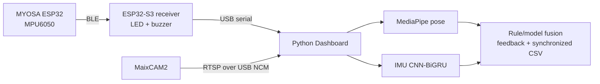

<div align="center">
  <h1>LiteRehab Fusion</h1>
  <p>Wearable IMU sensing, independent MaixCAM2 vision, and real-time rehabilitation feedback.</p>
  <p>
    
    
    
    
  </p>
  <p><a href="README.md">English</a> · <a href="README_zh.md">中文</a></p>
</div>

LiteRehab Fusion is a dual-board coursework and engineering prototype for upper-limb rehabilitation demonstrations. A MYOSA ESP32 wearable sends IMU motion data over BLE to an ESP32-S3 receiver, while an independent MaixCAM2 supplies video to a computer dashboard for synchronized feedback and logging.

**LiteRehab Fusion is not a medical device and does not replace a physiotherapist.**

## Current system status

| Component | Current implementation | Status |
|---|---|---|
| Wearable sensing | MYOSA ESP32 + MPU6050 at 50 Hz | Working |
| Wireless link | BLE wearable → ESP32-S3 receiver | Working |
| Physical feedback | Independent LED + passive buzzer | Working |
| Independent camera | MaixCAM2 RTSP over USB NCM | Working |
| Vision | MediaPipe pose on the computer | Working |
| IMU model | Auto-loaded CNN-BiGRU checkpoint | Working |
| Logging | Synchronized IMU/pose CSV with optional prediction and label fields | Working |

## How it works



MaixCAM2 replaces only the video input. MediaPipe pose processing, CNN-BiGRU inference, rule/model fusion, and synchronized logging all remain on the computer.

## Hardware and wiring

| Quantity | Part | Role |
|---:|---|---|
| 1 | MYOSA ESP32 WROOM-32E | Wearable BLE controller |
| 1 | MPU6050 | 50 Hz arm motion sensing |
| 1 | SSD1306 128×64 OLED | Wearable status and repetition count |
| 1 | ESP32-S3-DevKitC-1 N16R8 | BLE receiver and USB serial gateway |
| 1 each | LED, 220–330 Ω resistor, passive buzzer | Independent physical feedback |
| 1 | MaixCAM2 | Independent RTSP video source |
| 2 | Four-pin JST cables | Wearable I²C chain |
| 2–3 | USB data cables | Power, flashing, serial, and camera networking |

```text
Wearable: MYOSA I²C ── MPU6050 ── SSD1306 OLED
Receiver: GPIO2 ── resistor ── LED ── GND; GPIO18 ── resistor ── passive buzzer ── GND
Host: ESP32-S3 native USB and MaixCAM2 Type-C use separate USB data cables
```

Mount the MPU6050 firmly on the back of the forearm, with its X axis pointing toward the hand and Z axis away from the skin. Read the [complete wiring guide](WIRING_GUIDE.md) before powering the boards.

## Quick start

### 1. Flash the ESP32 boards

```bash
source ~/.espressif/v6.0.2/esp-idf/export.sh
./scripts/flash_wearable.sh /dev/cu.usbserial-WEARABLE
./scripts/flash_receiver.sh /dev/cu.usbmodem-RECEIVER
```

### 2. Install the computer environment

```bash
conda create -n literehab python=3.12 -y
conda activate literehab
pip install -r python/requirements.txt
```

### 3. Start MaixCAM2 RTSP

Connect MaixCAM2 to the computer with a USB data cable, open [maixcam2/main.py](maixcam2/main.py) in MaixVision, keep its committed `MODE = "rtsp"`, and run it. USB NCM is the current default network path.

### 4. Start the dashboard

```bash
PYTHON=python ./scripts/start_maixcam2_demo.sh rtsp://10.203.102.1:8554/live
```

If the USB NCM address differs, read the exact RTSP URL from the MaixVision terminal and pass it to the same command. The overlay should report connected serial and camera inputs and enter Fusion mode when the right shoulder, elbow, wrist, and hip are visible.

### Optional UVC mode

UVC remains available as an alternative when a local camera device is preferable. Switch MaixCAM2 to its UVC output, identify the local camera index with `PYTHONPATH=python python scripts/probe_cameras.py`, and pass that index to `PYTHON=python ./scripts/start_maixcam2_demo.sh`.

## Demo checklist

Place MaixCAM2 horizontally at chest height, about 1.5–2.0 m from the participant.

1. Stand upright with the right arm relaxed; focus the dashboard and press lowercase `b` to set the trunk baseline.
2. Perform a slow elbow flexion and return to neutral over 2–3 seconds.
3. Hold the elbow near 90° and rotate the forearm while keeping the upper arm still.
4. Demonstrate `too_fast`, `insufficient_range`, and visual `trunk_compensation` feedback.
5. Briefly cover the camera to confirm the dashboard falls back to IMU-only mode and returns to Fusion when pose tracking recovers.
6. Press `r` to reset the repetition range, or `q`/`Esc` to quit and close the CSV file.

The default session file is `python/sessions/maixcam2_demo.csv`.

## Model and data

The dashboard automatically loads `python/models/imu_cnnbigru.pt`. The checkpoint is a classroom baseline trained with 100-sample windows from a small public upper-limb IMU subset of the [Wearable sensors-based human activity recognition dataset](https://doi.org/10.17632/s86tdtmcc2.1), so users do not need to record their own training movements.

CNN-BiGRU inference runs on the computer. The idle state uses the ESP32 rule gate, and firmware rules remain the fallback for motion and feedback. This prototype makes no clinical accuracy claim.

## Verification

Run the complete project check:

```bash
./scripts/test_all.sh
```

The verified suite contains 61 Python tests, 3 C host tests, a dashboard checkpoint smoke test, a wearable ESP-IDF build, and a receiver ESP-IDF build.

## Repository map

```text
wearable/        MYOSA ESP32 firmware
receiver/        ESP32-S3 BLE receiver firmware
shared/          Packet, motion, and feedback logic shared by host tests
python/          Computer dashboard, synchronization, model, training, and tests
maixcam2/        MaixPy RTSP/UVC camera application
scripts/         Build, flash, camera probe, and demo launch helpers
tests/           Host-side C tests
docs/            Design and implementation records
```

## Documentation

- [MaixCAM2 setup](maixcam2/README.md)
- [Complete wiring guide](WIRING_GUIDE.md)
- [Step-by-step demonstration guide](DEMO_GUIDE.md)
- [Bilingual component list](COMPONENTS.md)

## Safety

LiteRehab Fusion is a coursework and engineering demonstration prototype, not a medical device. It is not intended for diagnosis, clinical scoring, treatment prescription, or unsupervised rehabilitation decisions. Stop the demonstration immediately if the participant feels pain, dizziness, numbness, or unusual discomfort.
