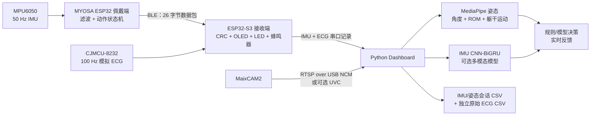

<div align="center">
  <h1>LiteRehab Fusion</h1>
  <p>佩戴式 IMU 感知、独立 MaixCAM2 视觉与上肢康复实时反馈。</p>
  <p>
    
    
    
    
  </p>
  <p><a href="README.md">English</a> · <a href="README_zh.md">中文</a></p>
</div>

LiteRehab Fusion 是一个面向 BMEG3920 课程与工程演示的上肢康复原型。MYOSA ESP32 佩戴端对前臂运动进行规则分类，并通过 BLE 发送 50 Hz 的 MPU6050 数据；ESP32-S3 接收端负责校验、声光反馈与 USB 串口转发。独立 MaixCAM2 向电脑端 Python Dashboard 提供视频，MediaPipe 姿态特征、可选神经网络推理、反馈融合、界面显示和同步 CSV 记录均在电脑上运行。

**LiteRehab Fusion 不是医疗器械，不用于诊断、治疗处方、康复评分，也不能替代专业人员监督。**

## 目录

- [系统概览](#系统概览)
- [架构与数据流](#架构与数据流)
- [可运行项目](#可运行项目)
- [快速开始](#快速开始)
- [操作与输出](#操作与输出)
- [仓库结构](#仓库结构)
- [Python 项目完整说明](#python-项目完整说明)
- [C 项目完整说明](#c-项目完整说明)
- [构建与验证](#构建与验证)
- [故障排查](#故障排查)
- [文档与安全边界](#文档与安全边界)

## 系统概览

| 组件 | 当前实现 | 状态 |
|---|---|---|
| 佩戴式感知 | MYOSA ESP32 + MPU6050，每 20 ms 采样一次（50 Hz） | 已实现 |
| 端侧动作逻辑 | 滤波、自适应阈值、两类动作、重复计数与质量判断 | 已实现 |
| 无线链路 | 带版本号和 CRC-16 的 26 字节 BLE 通知包 | 已实现 |
| 接收网关 | ESP32-S3 BLE Central、CJMCU-8232 ADC 采样与 USB 串口遥测 | 已实现 |
| ECG 感知 | CJMCU-8232 接 GPIO4，100 Hz 采样并保留同学的脉搏/BPM 变化逻辑 | 已实现；仅供演示 |
| 接收端显示与反馈 | SSD1306 状态显示、连接 LED、动作/ECG 排队蜂鸣模式 | 已实现 |
| 独立摄像头 | 默认 MaixCAM2 RTSP over USB NCM，可选 UVC | 已实现 |
| 电脑端视觉 | MediaPipe 姿态关键点以及关节/躯干特征 | 已实现 |
| IMU 模型 | 自动加载 CNN-BiGRU checkpoint | 已实现 |
| 多模态模型 | 双分支 CNN-BiGRU 代码与训练流程 | 可选；无默认融合 checkpoint |
| Dashboard 与记录 | 1280×720 界面、ECG 波形、同步 IMU/姿态 CSV 与独立 ECG CSV | 已实现 |

固件直接识别 `forearm_rotation` 和 `elbow_flexion`。随仓库提供的 IMU checkpoint 还包含 `shoulder_abduction`，但它不是第三个固件重复动作状态。当前模型和数据仅用于课堂基线演示，不能视为临床验证证据。

## 架构与数据流



MaixCAM2 只负责替换视频输入。姿态估计、IMU 推理、多模态推理、规则/模型决策、Dashboard 渲染和 CSV 记录全部保留在电脑端。

### 运行时流程

1. 轻量佩戴端初始化 I²C、查找 MPU6050、允许演示接线中 OLED 缺席，并在静止状态校准陀螺仪零偏。
2. 每 20 ms 读取一次六轴数据，更新动作状态机，生成带 CRC 的数据包并通知 BLE 接收端。
3. 接收端校验数据包、以 100 Hz 采样 CJMCU-8232 GPIO4、更新接收端 OLED、串行执行蜂鸣事件，并输出独立 `IMU,...`/`ECG,...` 记录。
4. Dashboard 使用电脑单调时钟记录 IMU、ECG 与摄像头帧的到达时间。
5. 当关键点可见时，MediaPipe 提取选定左右侧的肩、肘、腕、髋特征。
6. 同步器在 50 ms 容差内为每条 IMU 数据匹配最近的姿态数据；视觉缺失会被明确保留。
7. 固件警告拥有更高优先级。只有配置了多模态模型且置信度达到阈值时，模型才可替换普通规则输出。
8. 界面同时显示动作与滚动 ECG 波形。IMU/姿态继续使用原会话 CSV，原始 ECG 写入 `<session>_ecg.csv`，且不进入动作决策。

## 可运行项目

仓库包含 5 个彼此清晰的可运行或可构建单元：

| 项目 | 语言/运行时 | 目标平台 | 主入口 | 作用 |
|---|---|---|---|---|
| 佩戴端固件 | C / ESP-IDF | MYOSA ESP32 | `wearable/main/app_main.c` | 读取 MPU6050、识别动作、计数并发送 BLE；保留可选 OLED 兼容 |
| 接收端固件 | C / ESP-IDF | ESP32-S3-DevKitC-1 | `receiver/main/app_main.c` | 接收 BLE、采样 ECG、更新 OLED/LED/蜂鸣器并转发 IMU/ECG 串口记录 |
| 共享算法 | 可移植 C17 | 主机测试 + 固件 | `shared/*.c` | 定义数据包、动作、反馈和兼容同学代码的 ECG 阈值逻辑 |
| 电脑端应用 | Python 3.12 | macOS/Linux/Windows | `python/run_dashboard.py` | 读取 IMU/ECG/视频、显示 ECG/姿态、运行动作模型并写两类 CSV |
| 摄像头应用 | MaixPy | MaixCAM2 | `maixcam2/main.py` | 将内置摄像头发布为 RTSP 或可选 USB UVC |

## 快速开始

除非特别说明，以下命令均从仓库根目录运行。

### 1. 硬件与接线

| 数量 | 元件 | 作用 |
|---:|---|---|
| 1 | MYOSA ESP32 WROOM-32E | 佩戴端控制器与 BLE Peripheral |
| 1 | MPU6050 | 六轴前臂运动感知 |
| 1 | SSD1306 128×64 OLED | 接收端显示 BLE、ECG、次数和质量 |
| 1 | ESP32-S3-DevKitC-1 N16R8 | BLE Central 与原生 USB 串口网关 |
| 1 | CJMCU-8232 与三电极线/电极片 | 接收端单导联 ECG 波形 |
| 需要时 1 | 四针 JST 转杜邦线 | 将 MYOSA OLED 接到接收端 GPIO8/9/3V3/GND |
| 各 1 | LED、220–330 Ω 电阻、无源蜂鸣器 | 接收端连接和动作反馈 |
| 1 | MaixCAM2 | 独立 RTSP/UVC 视频源 |
| 2–3 | 支持数据传输的 USB 线 | 供电、烧录、串口和摄像头网络 |

```text
佩戴端 I²C：MYOSA 主板 -> MPU6050；两板刚性固定并约束线缆
接收端 LED：GPIO2 -> 220–330 Ω -> LED -> GND
接收端蜂鸣器：GPIO18 -> 100–330 Ω -> 无源蜂鸣器 -> GND
接收端 OLED：GPIO8 SDA、GPIO9 SCL、3V3、GND
接收端 ECG：GPIO4 OUTPUT、GPIO5 LO+、GPIO6 LO-、3V3/GND、SDN -> 3V3
电脑端：ESP32-S3 原生 USB 与 MaixCAM2 Type-C 使用独立数据线
```

接线前先断电。CJMCU-8232 只使用 3.3 V，GPIO19/20 留给原生 USB，N16R8 不使用 GPIO35–37。上电或贴电极前请阅读[完整接线指南](WIRING_GUIDE.md)。

### 2. 构建与烧录 ESP32 项目

辅助脚本使用本机 `~/.espressif/v6.0.2/esp-idf` 中的 ESP-IDF 6.0.2。

```bash
source ~/.espressif/v6.0.2/esp-idf/export.sh
./scripts/build_all.sh

./scripts/flash_wearable.sh /dev/cu.usbserial-WEARABLE
./scripts/flash_receiver.sh /dev/cu.usbmodem-RECEIVER
```

将示例端口替换为实际设备路径。如果 ESP32-S3 原生 USB 不稳定，可在命令前设置 `BAUD=115200`。

### 3. 创建电脑端 Python 环境

推荐 Python 3.12，因为当前依赖文件只在 Python 3.13 以下安装 MediaPipe。

```bash
conda create -n literehab python=3.12 -y
conda activate literehab
python -m pip install -r python/requirements.txt
```

核心依赖包括 NumPy、OpenCV、pyserial、MediaPipe、PyTorch 和 pytest。

### 4. 启动 MaixCAM2 视频源

使用支持数据传输的 Type-C 线连接 MaixCAM2。在 MaixVision 中打开 `maixcam2/main.py`，运行仓库默认设置：

```python
MODE = "rtsp"
```

MaixVision 终端会打印实际视频地址。通过 USB NCM 时通常为：

```text
rtsp://10.203.102.1:8554/live
```

如果需要本地 UVC 设备，将 `MODE` 改为 `"uvc"`，在 MaixCAM2 中启用 UVC，并探测电脑端相机编号：

```bash
PYTHONPATH=python python scripts/probe_cameras.py
```

### 5. 启动 Dashboard

启动脚本会选择右侧、自动查找 ESP32-S3 串口、写入 `python/sessions/maixcam2_demo.csv`，并由 Dashboard 自动加载 `python/models/imu_cnnbigru.pt`。

```bash
PYTHON=python ./scripts/start_maixcam2_demo.sh \
  rtsp://10.203.102.1:8554/live
```

如果 MaixVision 打印的地址不同，请使用该准确地址。使用 UVC 时，将 RTSP URL 换成探测到的数字相机编号。

### 6. 启动本地网页应用

演示版界面完全在笔记本本地运行，并自动用默认浏览器打开。首次启动会在需要时安装并构建 React 前端，之后直接复用本地构建结果。

```bash
# RTSP 摄像头
./scripts/start_web_demo.sh rtsp://10.203.102.1:8554/live

# UVC 摄像头编号
./scripts/start_web_demo.sh 2
```

网页地址为 `http://127.0.0.1:8000`，包含**实时训练**、**历史记录**和可打印的**单次报告**。按 `Ctrl+C` 停止服务；系统不需要账号、互联网或云数据库。若只想在不连接硬件、不打开浏览器的情况下检查网页栈：

```bash
./scripts/start_web_demo.sh --fixture --headless-smoke-test --no-browser
```

报告页的 **Print / Save PDF** 按钮调用浏览器打印，可在本地保存 PDF。报告只汇总已记录的工程演示数据，不提供诊断、治疗建议或经过验证的康复评分。

## 操作与输出

### 动作状态与反馈

| 类别 | 内部值 | 含义 | 输出行为 |
|---|---|---|---|
| 动作 | `idle` | 没有正在进行的重复动作 | Ready 状态 |
| 动作 | `forearm_rotation` | 类似前臂旋前/旋后 | 接收端 OLED 显示 `ROTATE` |
| 动作 | `elbow_flexion` | 类似肘关节屈伸往返 | 接收端 OLED 显示 `ELBOW` |
| 质量 | `none` | 尚无完成动作质量 | 不响 |
| 质量 | `ok` | 幅度充分且速度可接受 | 一声 880 Hz 成功音 |
| 质量 | `too_fast` | 持续时间过短或峰值速度过高 | 静音；质量状态仍会显示和记录 |
| 质量 | `insufficient_range` | 积分角度范围低于阈值 | 静音；质量状态仍会显示和记录，次数不增加 |
| 视觉 | `trunk_compensation` | 肩部相对髋部的偏移超过视觉阈值 | Dashboard 安全提示 |
| ECG | 导联断开 | CJMCU `LO+` 或 `LO-` 为高 | OLED/Dashboard 显示 `LEADS OFF`，不作 ECG 心跳判断 |
| ECG | 滤波 BPM 连续 3 次 `> 150` | 最近有效 RR 间隔中位数持续偏高 | 发出一次五连响；连续 3 次降至 140 BPM 或以下后重新允许报警；不改变动作反馈 |

### Dashboard 按键

| 按键 | 功能 |
|---|---|
| `b` | 清除已有躯干基线；下一帧有效姿态成为新基线 |
| `r` | 重置当前重复动作的活动范围追踪器 |
| `q` 或 `Esc` | 刷新剩余同步样本、关闭资源并退出 |

### Dashboard 命令行参数

```bash
PYTHONPATH=python python python/run_dashboard.py --help
```

| 参数 | 默认值 | 说明 |
|---|---|---|
| `--port` | `auto` | 接收端串口；自动选择优先 `usbmodem`，其次 `usbserial` |
| `--camera` | `0` | 兼容旧接口的本地相机编号 |
| `--camera-source` | 未设置 | 推荐视频输入：`auto`、非负编号或 `rtsp://` URL |
| `--output` | `sessions/session.csv` | IMU/姿态会话 CSV；旁边自动生成 `session_ecg.csv` |
| `--model` | `python/models/imu_cnnbigru.pt` | IMU checkpoint；已配置路径缺失时会明确终止 |
| `--fusion-model` | 未设置 | 可选的同步 IMU/姿态 checkpoint |
| `--model-confidence` | `0.70` | 采用多模态输出所需的最低置信度 |
| `--side` | `left` | MediaPipe 侧别；可选 `left`/`right`，演示脚本使用 `right` |
| `--subject` | 空 | 写入每行 CSV 的参与者编号 |
| `--label-exercise` | 空 | 数据采集时可选的动作真值标签 |
| `--label-quality` | 空 | 数据采集时可选的质量真值标签 |
| `--headless-smoke-test` | 关闭 | 不打开硬件或 GUI，只验证 IMU checkpoint 和纯运行状态 |

当摄像头或关键点不可用时，界面切换为 `IMU Only`；串口处理和 IMU 反馈仍继续。恢复有效画面与关键点后，视觉会自动重新参与融合。

### 会话 CSV 字段

当前 Dashboard 写入 27 列：

| 分组 | 字段 |
|---|---|
| 时间 | `t_ms`, `received_s` |
| 原始 IMU | `ax`, `ay`, `az`, `gx`, `gy`, `gz` |
| 固件决策 | `state`, `rep_count`, `quality` |
| 姿态 | `elbow_angle_deg`, `shoulder_angle_deg`, `trunk_displacement`, `wrist_x`, `wrist_y`, `elbow_velocity_dps`, `shoulder_velocity_dps`, `visibility`, `vision_valid` |
| 可选模型 | `model_exercise`, `model_quality`, `model_confidence`, `visual_confidence` |
| 训练信息 | `subject`, `label_exercise`, `label_quality` |

如果 50 ms 同步容差内没有姿态样本，姿态值填 0，`vision_valid` 为 `0.0`。`t_ms` 保留佩戴端时间戳，`received_s` 是用于跨设备匹配的电脑单调时钟接收时间。

独立 `<session>_ecg.csv` 以最高 100 Hz 保存 `t_ms`、`received_s`、`raw_adc`、`bpm`、`leads_connected`、`beat` 和 `high_bpm_alert`。ECG 演示报警仅在滤波后的 BPM 连续 3 次高于 150 时触发一次；连续 3 次降至 140 BPM 或以下后才重新允许报警。该课堂演示规则未经医学验证。分开记录可保持原 IMU/姿态训练 schema 不变；ECG 不传入 CNN、次数逻辑、质量规则或反馈融合。

## 仓库结构

以下同时标出源码和运行产物；构建目录、缓存、会话记录和本地模型不是手写源码。

```text
lite_rehab_mvp/
├── README.md / README_zh.md       项目概览与完整源码指南
├── COMPONENTS.md                  中英文元器件表
├── WIRING_GUIDE.md                电气连接与上电检查
├── DEMO_GUIDE.md                  详细演示流程
├── wearable/                      ESP32 佩戴端固件项目
│   ├── CMakeLists.txt
│   ├── sdkconfig.defaults
│   └── main/                      MPU、可选 OLED、BLE Server、状态和入口
├── receiver/                      ESP32-S3 接收端固件项目
│   ├── CMakeLists.txt
│   ├── sdkconfig.defaults
│   └── main/                      BLE、ECG ADC、OLED、输出、遥测和入口
├── shared/                        可移植数据包、动作、反馈与 ECG 逻辑
├── tests/                         C17 主机测试和运行脚本
├── python/
│   ├── run_dashboard.py           电脑端实时应用
│   ├── collect_data.py            带标签 IMU 采集器
│   ├── prepare_public_imu.py      公开数据转换器
│   ├── train_1d_cnn.py            IMU 模型训练
│   ├── train_multimodal.py        IMU/姿态融合模型训练
│   ├── literehab/                 可复用 Python 包
│   ├── tests/                     Python 测试套件
│   ├── data/imu_public_small/     已跟踪的 7,600 条公开子集
│   ├── models/                    本地模型/任务文件（gitignore）
│   └── sessions/                  IMU/姿态与 *_ecg CSV（gitignore）
├── maixcam2/                      MaixPy RTSP/UVC 应用和设置指南
├── scripts/                       构建、烧录、启动、探测和测试工具
├── docs/                          Pitch 文案以及设计/实施记录
├── assets/institutions/           Pitch PDF 使用的机构 Logo
└── output/pdf/                    可编辑 LaTeX Pitch 与编译 PDF
```

本地 `.worktrees/`、`wearable/build/`、`receiver/build/`、`tests/build/`、`.pytest_cache/`、`.cache/` 和 `__pycache__/` 均为开发产物，不是额外的 LiteRehab 项目。

## Python 项目完整说明

### 可执行 Python 与 MaixPy 文件

| 文件 | 内容与职责 | 典型用途 |
|---|---|---|
| `python/run_dashboard.py` | 独立 IMU/ECG 队列、摄像头与姿态、同步、动作推理、ECG 独立记录、OpenCV UI 与资源清理 | `PYTHONPATH=python python python/run_dashboard.py ...` |
| `python/collect_data.py` | 从接收端录制固定时长、单一标签的 IMU CSV；自动选串口并保存 subject/label | 在 `python/` 运行或显式指定输出目录 |
| `python/prepare_public_imu.py` | 将 Apple Watch 源 CSV 转为有限右腕子集；映射 3 类动作、降采样到 50 Hz、将 rad/s 转为 deg/s | 从引用数据集重建公开小子集 |
| `python/train_1d_cnn.py` | 读取标签记录，以步长 50 生成 100 点窗口，进行按参与者留出训练，保存 `cnn_1d` 或 `cnn_bigru` checkpoint | 训练或重训 IMU 分类器 |
| `python/train_multimodal.py` | 读取同步 IMU/姿态 CSV，要求每文件只有一个 subject/exercise/quality 组合，训练双分支 CNN-BiGRU 并保存 schema | 可选融合模型训练 |
| `scripts/probe_cameras.py` | 在有限 OpenCV 编号范围内查找能返回完整帧的本地相机 | 查找 MaixCAM2 UVC 编号 |
| `maixcam2/main.py` | 提供 `run_rtsp()` 与 `run_uvc()`；默认 640×480、30 FPS RTSP | 在 MaixVision/MaixCAM2 上运行 |

### `python/literehab` 包模块

| 模块 | 内容与公开职责 |
|---|---|
| `__init__.py` | 标记可复用的电脑端处理包 |
| `camera_source.py` | 校验 `auto`/编号/RTSP 输入，探测本地相机，设置低延迟参数，维护健康状态，限速重连并释放 OpenCV 资源 |
| `cnn.py` | 构建六通道 IMU `cnn_1d` 和三层卷积 CNN-BiGRU |
| `dashboard_state.py` | 定义 CSV 字段、置信度规则/模型决策、规则警告优先级、摄像头健康、躯干代偿门控和同步行构造 |
| `dashboard_view.py` | 渲染 1280×720 Dashboard、动作反馈/指标以及带 BPM/导联状态的滚动 ECG 波形 |
| `dataset.py` | 创建固定长度重叠 NumPy 窗口，并校验维度和参数 |
| `fusion.py` | 应用反馈优先级，返回 `Fusion`/`IMU-only` 模式和面向用户的提示 |
| `multimodal.py` | 定义姿态 schema、双时序 CNN-BiGRU、checkpoint 校验、滑动窗口推理、可见度门控和预测数据类 |
| `pose_features.py` | 选择左右侧 MediaPipe 关键点，计算关节角、归一化腕位置、角速度、可见度、躯干偏移和单次 ROM |
| `pose_math.py` | 提供三点角度和归一化躯干代偿几何函数 |
| `synchronization.py` | 缓存串口与姿态数据，在 50 ms 内匹配最近姿态，每条 IMU 只排出一次并保留视觉缺失 |
| `telemetry.py` | 校验原有 11 字段 `IMU,...` 与独立 7 字段 `ECG,...` 串口行 |

### 模型与数据

| 路径 | 内容 |
|---|---|
| `python/models/imu_cnnbigru.pt` | 随项目提供的课堂 checkpoint：100 点、6 通道 CNN-BiGRU，标签为 `elbow_flexion`、`forearm_rotation`、`shoulder_abduction` |
| `python/models/pose_landmarker_lite.task` | 当旧版 `mp.solutions` 不可用时由 MediaPipe Tasks 使用的姿态模型 |
| `python/data/imu_public_small/*.csv` | 3 位公开参与者、3 类动作的 9 段右腕记录，共 7,600 行数据 |
| `python/sessions/*.csv` | IMU/姿态会话与配套 `*_ecg.csv` 波形记录；默认不视为训练真值 |

公开子集来源于 [Wearable sensors-based human activity recognition dataset](https://doi.org/10.17632/s86tdtmcc2.1)，许可证为 CC BY 4.0。该数据集规模很小，checkpoint 只适用于课程演示，不作泛化能力或临床准确性声明。

### Python 测试

| 测试文件 | 覆盖内容 |
|---|---|
| `test_camera_source.py` | 输入解析、相机探测、捕获参数、健康状态、重连节流、RTSP 与清理 |
| `test_dashboard_cli.py` | CLI、串口优先级、有界队列、ECG 输出路径、模型行为、冒烟测试与渲染集成 |
| `test_dashboard_state.py` | 置信度回退、警告优先级、摄像头恢复、躯干门控和完整 CSV 行 |
| `test_dashboard_view.py` | 显示语义、卡片、反馈、固定画布、ECG 波形/导联状态与摄像头失败界面 |
| `test_dataset.py` | 窗口长度、重叠和过短记录 |
| `test_fusion.py` | IMU-only 回退与反馈优先级 |
| `test_maixcam2_script.py` | RTSP 默认值和支持的 UVC Server 构造 |
| `test_multimodal.py` | 张量形状、零置信度视觉门控、checkpoint schema 和滑动推理 |
| `test_pose_features.py` | 左右对称、可见度 mask、侧别校验和每次重复 ROM 重置 |
| `test_pose_math.py` | 关节角几何和归一化躯干偏移 |
| `test_prepare_public_imu.py` | 标签/单位/采样率转换和有限记录选择 |
| `test_synchronization.py` | 最近姿态匹配、显式视觉缺失、无损排出与退出刷新 |
| `test_telemetry.py` | 合法 IMU/ECG 解析以及异常、越界与未知状态拒绝 |
| `test_train_multimodal.py` | 同步训练 schema 与可加载 checkpoint 生成 |

## C 项目完整说明

### 佩戴端固件：`wearable/`

目标为 MYOSA ESP32 WROOM-32E（`esp32`）。组件链接共享的数据包与动作模块，并依赖 ESP-IDF I²C、GPIO、Bluetooth 和 NVS。

| 文件 | 内容与职责 |
|---|---|
| `wearable/CMakeLists.txt` | 声明 `literehab_wearable` ESP-IDF 项目 |
| `wearable/sdkconfig.defaults` | 选择 ESP32、NimBLE Peripheral、MTU 64、4 MB Flash 和 6144 字节主任务栈 |
| `wearable/main/CMakeLists.txt` | 注册全部佩戴端源码以及共享 `motion_packet.c`、`motion_logic.c` |
| `wearable/main/app_main.c` | 配置 GPIO21/22 I²C、扫描设备、初始化 OLED/MPU/BLE、校准 100 个样本、运行 50 Hz 循环、生成数据包并每 10 个样本刷新 OLED |
| `wearable/main/mpu6050.c/.h` | 探测 `0x68`/`0x69`，配置 ±2 g 与 ±250 dps，读取 14 字节帧并估计陀螺仪零偏 |
| `wearable/main/ssd1306.c/.h` | 最小 SSD1306 驱动：1024 字节 framebuffer、小型字符表、文本行、初始化与逐页刷新 |
| `wearable/main/ble_server.c/.h` | 名称为 `LiteRehab-Wear` 的 NimBLE GATT Peripheral；公开一组 128-bit Service/Characteristic 并在订阅后发送通知 |
| `wearable/main/wearable_status.c/.h` | 使用 GPIO2 指示连接/错误状态 |

动作循环使用 `16384 LSB/g` 和 `131 LSB/(deg/s)` 将数据转换后用于分类，但 BLE 包发送的是原始有符号 16 位传感器值。

### 接收端固件：`receiver/`

目标为 ESP32-S3-DevKitC-1 N16R8（`esp32s3`）。组件链接共享数据包、反馈和 ECG 逻辑，并依赖 NimBLE、NVS、ADC1、I²C、GPIO 和 LEDC。

| 文件 | 内容与职责 |
|---|---|
| `receiver/CMakeLists.txt` | 声明 `literehab_receiver` ESP-IDF 项目 |
| `receiver/sdkconfig.defaults` | 选择 ESP32-S3、NimBLE Central、MTU 64、16 MB Flash、80 MHz Octal PSRAM、原生 USB Console 和 6144 字节主任务栈 |
| `receiver/main/CMakeLists.txt` | 注册接收端、共享 ECG/数据包/反馈、复用 SSD1306 源码与 ADC/I²C 依赖 |
| `receiver/main/app_main.c` | 初始化显示、输出、ECG 与 BLE，分开分发动作和 ECG，不混入动作决策 |
| `receiver/main/ble_client.c/.h` | 扫描 `LiteRehab-Wear`、连接、交换 MTU、发现自定义服务/特征、启用通知、校验长度/CRC，并在断线后重连 |
| `receiver/main/ecg_monitor.c/.h` | 以 100 Hz 采样 CJMCU-8232 GPIO4，读取 GPIO5/6 导联状态并调用共享阈值逻辑 |
| `receiver/main/receiver_display.c/.h` | 用 GPIO8/9 驱动 SSD1306，以互斥保护的 BLE/动作/ECG 状态每秒刷新 5 次 |
| `receiver/main/receiver_outputs.c/.h` | 通过同一个 GPIO18 LEDC 队列串行动作和 ECG 蜂鸣模式，并控制 GPIO2 LED |
| `receiver/main/serial_telemetry.c/.h` | 保持原 `IMU,...` 不变，并输出独立 `ECG,...` 记录 |

### 共享可移植 C：`shared/`

| 文件 | 内容与职责 |
|---|---|
| `motion_packet.h` | 定义动作/质量枚举和 packed version-1 `motion_packet_t` 线协议 |
| `motion_packet.c` | 静态保证 26 字节大小，计算 CRC-16，完成数据包并校验 magic/version/CRC |
| `motion_logic.h` | 定义可调阈值、公开动作结果以及状态机/滤波器持久状态 |
| `motion_logic.c` | 实现陀螺仪低通、Roll/Pitch 互补滤波、仅 idle 更新的自适应阈值、轴/加速度分类、反向阶段、幅度积分、速度/范围质量、refractory 时间和计数 |
| `feedback_logic.h` | 定义 `NONE`、`SUCCESS`、`WARNING` 接收端事件与转移状态 |
| `feedback_logic.c` | 只有质量为正常且被计数的动作才产生成功音；过快、未完成、重复和过期数据均保持静音 |
| `ecg_logic.h/.c` | 保留阈值 2500、250 ms、`60000/delta` 与 BPM 差值 `>20`，只补下降沿 latch 释放和导联断开重置 |

#### BLE 数据包布局

| 字段 | 类型 | 字节 | 含义 |
|---|---|---:|---|
| `magic` / `version` | `uint8_t` + `uint8_t` | 2 | `0xA5`，协议版本 `1` |
| `sequence` | `uint16_t` | 2 | 可回绕的通知序号 |
| `timestamp_ms` | `uint32_t` | 4 | 佩戴端运行时间戳 |
| `accel[3]` | `int16_t[3]` | 6 | MPU6050 原始加速度 |
| `gyro[3]` | `int16_t[3]` | 6 | 扣除零偏后的原始陀螺仪 |
| `rep_count` | `uint16_t` | 2 | 已接受的重复次数 |
| `state` / `quality` | `uint8_t` + `uint8_t` | 2 | 动作和最近质量枚举 |
| `crc16` | `uint16_t` | 2 | 对前 24 字节计算的 CRC |

CRC 初值为 `0xFFFF`，多项式为 `0x1021`。修改 packed 布局时必须决定是否升级协议版本，并同步更新两块开发板和主机测试。

### C 主机测试：`tests/`

| 文件 | 覆盖内容 |
|---|---|
| `run_host_tests.sh` | 使用 C17、`-Wall -Wextra -Werror` 编译共享代码，按需链接数学库并运行 4 个测试程序 |
| `test_motion_packet.c` | 数据包大小、完成/校验、数据损坏与 magic 错误拒绝 |
| `test_motion_logic.c` | idle、两类动作循环、正常/过快/幅度不足结果、计数和仅 idle 阈值更新 |
| `test_feedback_logic.c` | 只有正常质量的计数增加产生成功事件；过快、重复、回退和初始数据保持静音 |
| `test_ecg_logic.c` | 固定阈值、latch 释放、严格 250 ms、BPM、`>20` 警告和导联断开重置 |

## 构建与验证

### 单项检查

```bash
# 可移植 C 逻辑
./tests/run_host_tests.sh

# Python 测试套件
PYTHONPATH=python python -m pytest -q python/tests

# Dashboard checkpoint 与纯状态冒烟测试
PYTHONPATH=python python python/run_dashboard.py --headless-smoke-test

# 两个 ESP-IDF 固件项目
./scripts/build_all.sh
```

### 完整仓库检查

```bash
PYTHON=python ./scripts/test_all.sh
```

完整检查会运行 C 与脚本测试、Python 主程序与 benchmark 测试、Python 语法和 Dashboard 冒烟检查、Web 测试/构建、Swift 测试、可用的 iOS 模拟器测试以及两套 ESP-IDF 构建。BLE、摄像头、CJMCU-8232/电极、OLED、LED 和蜂鸣器仍需按 [DEMO_GUIDE.md](DEMO_GUIDE.md) 在真实硬件上验收。

### 辅助脚本

| 脚本 | 作用 |
|---|---|
| `scripts/demo_doctor.sh` | 演示前检查 Python、运行依赖、模型、Web 构建、串口设备和 ESP-IDF |
| `scripts/build_all.sh` | 自动发现当前 ESP-IDF 环境并构建两个固件项目 |
| `scripts/flash_wearable.sh` | 将 `wearable/` 烧录到指定串口 |
| `scripts/flash_receiver.sh` | 将 `receiver/` 烧录到指定原生 USB 端口 |
| `scripts/start_maixcam2_demo.sh` | 使用给定视频源启动右臂 Dashboard，并固定会话路径 |
| `scripts/probe_cameras.py` | 列出可用的本地 OpenCV/UVC 编号 |
| `scripts/test_all.sh` | 运行 C、脚本、Python、benchmark、Web、Swift/iOS、冒烟和固件构建检查 |

## 原生 iPhone App（iOS 17+）

原生 SwiftUI App 位于 `ios/`，复用 Stanford Spezi 的 onboarding 与任务流程设计，保持竖屏、全英文。底部只保留 **Live** 和 **History** 两个主要标签，**Settings** 从右上角齿轮打开。Mac 仍负责硬件、推理、记录与完整报告；iPhone 通过带访问令牌的本地网络连接，负责引导式准备、训练与回顾。

Live 的真实流程为 **Preflight → 3-2-1 baseline → Active Training → Completion**。Mac 与串口动作传感器属于必需条件；无线相机、ECG 和可选融合模型属于可选条件，缺失时必须明确点击 **Start Anyway**。没有融合 checkpoint 时，规则式动作质量反馈仍然可用。训练期间相机会自适应降频重试；相机短暂中断或 Mac 重连不会错误结束当前 Session。

### 构建并安装到几台 iPhone

1. 安装完整 Xcode，首次打开后在 **Xcode → Settings → Components** 安装 iOS Simulator；如有需要执行 `sudo xcode-select -s /Applications/Xcode.app/Contents/Developer`。
2. 安装 XcodeGen：`brew install xcodegen`。
3. 安装 Python 依赖：`python -m pip install -r python/requirements.txt`。
4. 生成工程：`cd ios && xcodegen generate`。
5. 打开 `ios/LiteRehab.xcodeproj`，在 **LiteRehab → Signing & Capabilities** 选择自己的 Personal Team；若 Xcode 提示冲突，改成唯一的 Bundle Identifier。
6. 连接 iPhone，按提示开启 Developer Mode，在 Xcode 顶部选择该手机并点击 Run；其他组员手机重复此步骤。

最终无线硬件 demo 请在激活 Python 3.10–3.12 环境后，从新克隆仓库的根目录运行：

```bash
cd /path/to/lite_rehab_mvp
python -m pip install -r python/requirements.txt
export MAC_IP="<本机局域网 IP>"
export CAMERA_RTSP="rtsp://<MaixCAM 局域网 IP>:8554/live"
./scripts/demo_doctor.sh

PYTHONPATH=python python python/run_web_dashboard.py \
  --host 0.0.0.0 \
  --web-port 8000 \
  --mobile \
  --advertised-host "$MAC_IP" \
  --no-browser \
  --port auto \
  --camera-source "$CAMERA_RTSP" \
  --side right \
  --sessions-dir python/sessions \
  --model python/models/imu_cnnbigru.pt
```

热点重新分配地址后要同时修改两个 IP。MaixCAM 终端即使显示 `rtsp://0.0.0.0:8554/live`，Mac 端也必须填写相机在局域网中可访问的真实 IP。Mac、MaixCAM 与 iPhone 要处于同一个可信网络；扫描终端二维码后保持命令运行，电脑 Dashboard 与手机才会持续同步。课程演示不需要提交 App Store。免费的 Apple Personal Team 签名通常 7 天后过期，到期后用 Xcode 重新 Run 即可。

iPhone 令牌保存在 Keychain；Mac 生成的令牌和二维码文件只保存在本机并已被 Git 忽略，不应公开分享。

## 故障排查

| 现象 | 可能原因 | 处理方法 |
|---|---|---|
| 接收端 OLED 黑屏 | GPIO8/9、3V3/GND 顺序错误或 OLED 缺失 | 断电核对丝印/JST 转接与地址 `0x3C`；BLE/ECG 可继续运行 |
| 接收端 OLED 一直 `BLE WAIT` | 佩戴端未上电、未烧录或未订阅 | 上电/烧录佩戴端并将两板保持在数米内 |
| `LEADS OFF` 一直不消失 | 电极接触或 LO+/LO- 接线错误 | 检查 RA/LA/RL 电极和 GPIO5/6，清洁干燥皮肤并保持静止 |
| ECG 波形平直或噪声大 | GPIO4 错接、电极松、模拟线过长或蜂鸣器/USB 串扰 | 核对 `OUTPUT -> GPIO4`，缩短并分离模拟线，保持静止 |
| 找不到接收端串口 | ESP32-S3 接口或线缆错误 | 使用标有 `USB` 的原生接口和数据线 |
| ESP32-S3 烧录失败 | 原生 USB 复位或波特率不稳定 | 关闭串口占用，使用 BOOT+RST 进入下载模式，以 `BAUD=115200` 重试 |
| Dashboard 提示无串口 | 接收端断开或端口被占用 | 关闭 `idf.py monitor` 等工具，并显式传入 `--port` |
| 找不到 IMU checkpoint | `python/models/imu_cnnbigru.pt` 缺失 | 恢复模型文件或通过 `--model` 传入合法路径 |
| Camera unavailable/retrying | URL/编号、线缆、权限或视频流错误 | 准确复制 MaixVision URL，或重新运行 `scripts/probe_cameras.py` |
| 有画面但一直 `IMU Only` | 所选侧关键点不完整 | 选择正确 `--side`，确保肩、肘、腕、髋无遮挡 |
| Python 3.13 没有 MediaPipe | 依赖标记有意限制版本 | 使用推荐的 Python 3.12 环境 |
| 重复计数不稳定 | 传感器方向、固定或阈值问题 | 牢固固定 MPU6050；修改 `motion_default_config()` 时必须补充主机测试 |

## 文档与安全边界

- [完整接线指南](WIRING_GUIDE.md)
- [分步演示指南](DEMO_GUIDE.md)
- [中英文元器件清单](COMPONENTS.md)
- [MaixCAM2 设置与官方参考](maixcam2/README.md)
- `docs/superpowers/specs/`：已确认设计记录
- `docs/superpowers/plans/`：历史实施计划
- `docs/pitch/` 与 `output/pdf/`：课程单页 Pitch 源文件和输出

### 安全边界

本仓库仅用于工程演示，不用于诊断、治疗处方、临床评分、跌倒预防或无人监督的康复决策。小规模公开数据模型没有经过临床验证。训练动作的选择和监督责任始终属于理疗师或其他合格专业人员。

如果参与者出现疼痛、头晕、麻木、失去平衡、异常疲劳或任何不适，应立即停止。ECG 电极接触人体时，应拔掉笔记本交流充电器并使用电池供电。不要使用松动接线，不要反插 JST，不要给 CJMCU-8232 或 GPIO 接 5 V，也不要把电流未知的蜂鸣器直接接到 ESP32-S3。
