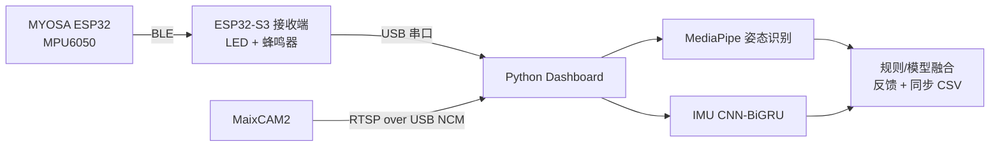

<div align="center">
  <h1>LiteRehab Fusion</h1>
  <p>佩戴式 IMU 感知、独立 MaixCAM2 视觉与实时康复反馈。</p>
  <p>
    
    
    
    
  </p>
  <p><a href="README.md">English</a> · <a href="README_zh.md">中文</a></p>
</div>

LiteRehab Fusion 是一个用于上肢康复演示的双开发板课程与工程原型。MYOSA ESP32 佩戴端通过 BLE 将 IMU 运动数据发送到 ESP32-S3 接收端，同时独立 MaixCAM2 向电脑端 Dashboard 提供视频，实现同步反馈与记录。

**LiteRehab Fusion 不是医疗器械，也不能替代理疗师。**

## 当前系统状态

| 组件 | 当前实现 | 状态 |
|---|---|---|
| 佩戴式感知 | MYOSA ESP32 + MPU6050，采样率 50 Hz | 可用 |
| 无线链路 | BLE 佩戴端 → ESP32-S3 接收端 | 可用 |
| 物理反馈 | 独立 LED + 无源蜂鸣器 | 可用 |
| 独立摄像头 | MaixCAM2 RTSP over USB NCM | 可用 |
| 视觉 | 电脑端 MediaPipe 姿态识别 | 可用 |
| IMU 模型 | 自动加载 CNN-BiGRU checkpoint | 可用 |
| 记录 | 同步记录 IMU/姿态 CSV，并提供可选预测与标签字段 | 可用 |

## 系统工作方式



独立摄像头只替换视频输入；MediaPipe、CNN-BiGRU、融合与记录仍运行在电脑端。

## 硬件与接线

| 数量 | 元件 | 用途 |
|---:|---|---|
| 1 | MYOSA ESP32 WROOM-32E | 佩戴端 BLE 控制器 |
| 1 | MPU6050 | 50 Hz 手臂运动感知 |
| 1 | SSD1306 128×64 OLED | 佩戴端状态与重复次数显示 |
| 1 | ESP32-S3-DevKitC-1 N16R8 | BLE 接收和 USB 串口网关 |
| 各 1 | LED、220–330 Ω 电阻、无源蜂鸣器 | 独立物理反馈 |
| 1 | MaixCAM2 | 独立 RTSP 视频源 |
| 2 | 四芯 JST 线 | 佩戴端 I²C 级联 |
| 2–3 | USB 数据线 | 供电、烧录、串口和摄像头网络 |

```text
穿戴端：MYOSA I²C ── MPU6050 ── SSD1306 OLED
接收端：GPIO2 ── 电阻 ── LED ── GND；GPIO18 ── 电阻 ── 无源蜂鸣器 ── GND
电脑端：ESP32-S3 原生 USB 与 MaixCAM2 Type-C 分别使用独立 USB 数据线
```

将 MPU6050 牢固固定在前臂背侧，X 轴指向手部，Z 轴朝向皮肤外侧。上电前请阅读[完整接线指南](WIRING_GUIDE.md)。

## 快速开始

### 1. 烧录 ESP32 开发板

```bash
source ~/.espressif/v6.0.2/esp-idf/export.sh
./scripts/flash_wearable.sh /dev/cu.usbserial-WEARABLE
./scripts/flash_receiver.sh /dev/cu.usbmodem-RECEIVER
```

### 2. 安装电脑端环境

```bash
conda create -n literehab python=3.12 -y
conda activate literehab
pip install -r python/requirements.txt
```

### 3. 启动 MaixCAM2 RTSP

使用 USB 数据线将 MaixCAM2 连接到电脑，在 MaixVision 中打开 [maixcam2/main.py](maixcam2/main.py)，保持已提交的 `MODE = "rtsp"` 设置并运行。USB NCM 是当前默认网络路径。

### 4. 启动 Dashboard

```bash
PYTHON=python ./scripts/start_maixcam2_demo.sh rtsp://10.203.102.1:8554/live
```

如果 USB NCM 地址不同，请从 MaixVision 终端读取准确的 RTSP URL，并传给同一命令。画面叠加信息应显示串口和摄像头均已连接；当右肩、右肘、右手腕和右髋可见时，系统将进入 Fusion 模式。

### 可选 UVC 模式

需要使用本地摄像头设备时，仍可选择 UVC。将 MaixCAM2 切换到 UVC 输出，使用 `PYTHONPATH=python python scripts/probe_cameras.py` 确认本地摄像头编号，再将该编号传给 `PYTHON=python ./scripts/start_maixcam2_demo.sh`。

## 演示检查表

将 MaixCAM2 横向放置在与参与者胸口接近的高度，距离约 1.5–2.0 m。

1. 身体直立、右臂自然下垂；点击 Dashboard 窗口使其获得焦点，然后按小写 `b` 设置躯干基线。
2. 用 2–3 秒缓慢完成一次肘部屈伸并回到中立位。
3. 肘部保持约 90°，固定上臂并旋转前臂。
4. 演示 `too_fast`、`insufficient_range` 和视觉 `trunk_compensation` 反馈。
5. 短暂遮挡摄像头，确认 Dashboard 回退到 IMU-only 模式，并在姿态跟踪恢复后返回 Fusion。
6. 按 `r` 重置重复动作的活动范围，或按 `q`/`Esc` 退出并关闭 CSV 文件。

默认会话文件为 `python/sessions/maixcam2_demo.csv`。

## 模型与数据

Dashboard 默认加载 `python/models/imu_cnnbigru.pt`。该 checkpoint 是一个课堂基线模型，使用 [Wearable sensors-based human activity recognition dataset](https://doi.org/10.17632/s86tdtmcc2.1) 中公开小规模上肢 IMU 子集的 100 采样点窗口训练，因此无需用户自行录制训练动作。

CNN-BiGRU 推理运行在电脑端。静止状态由 ESP32 规则门控，固件规则仍是动作识别和反馈的回退路径。本原型不作临床准确性声明。

## 验证

运行完整项目检查：

```bash
./scripts/test_all.sh
```

经验证的完整检查包含 61 项 Python 测试、3 项 C 主机测试、Dashboard 模型加载冒烟测试、佩戴端 ESP-IDF 构建和接收端 ESP-IDF 构建。

## 项目结构

```text
wearable/        MYOSA ESP32 佩戴端固件
receiver/        ESP32-S3 BLE 接收端固件
shared/          主机测试共用的数据包、动作与反馈逻辑
python/          电脑端 Dashboard、同步、模型、训练和测试
maixcam2/        MaixPy RTSP/UVC 摄像头应用
scripts/         构建、烧录、摄像头探测和演示启动辅助脚本
tests/           C 语言主机测试
docs/            设计与实现记录
```

## 相关文档

- [MaixCAM2 设置](maixcam2/README.md)
- [完整接线指南](WIRING_GUIDE.md)
- [分步演示指南](DEMO_GUIDE.md)
- [中英文元器件清单](COMPONENTS.md)

## 安全说明

LiteRehab Fusion 是用于课程和工程演示的原型，不是医疗器械。它不用于诊断、临床评分、治疗处方或无人监督的康复决策。演示过程中，如果参与者出现疼痛、头晕、麻木或其他异常不适，应立即停止。
