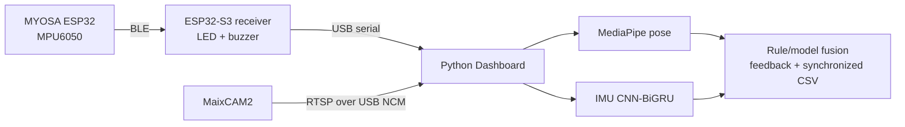

# LiteRehab README Refresh Implementation Plan

> **For agentic workers:** REQUIRED SUB-SKILL: Use superpowers:subagent-driven-development (recommended) or superpowers:executing-plans to implement this plan task-by-task. Steps use checkbox (`- [ ]`) syntax for tracking.

**Goal:** Replace the outdated, text-heavy GitHub landing documentation with concise bilingual README pages that accurately describe the working RTSP camera and public-data CNN-BiGRU system.

**Architecture:** This is a documentation-only change. `README.md` remains the default English GitHub landing page and `README_zh.md` mirrors the same structure in Chinese; both use static badges, one Mermaid data-flow diagram, a current-status table, and the same verified commands and paths.

**Tech Stack:** GitHub-Flavored Markdown, Mermaid, static shields.io badges, ESP-IDF 6.0.2, Python 3.12, MaixCAM2 RTSP, CNN-BiGRU

## Global Constraints

- Do not modify firmware, Python runtime code, MaixCAM2 runtime code, model weights, or training data.
- Describe MaixCAM2 RTSP over USB NCM as the current default video path; describe UVC only as an optional alternative.
- State that CNN-BiGRU and MediaPipe run on the computer, not on the camera or ESP32 boards.
- State that `python/models/imu_cnnbigru.pt` loads automatically and uses a small public IMU subset.
- State the verified totals as 61 Python tests and 3 C host tests.
- Keep the medical-prototype limitation and participant stop conditions visible.
- Keep English and Chinese commands, file paths, feature status, and safety statements semantically equivalent.

---

### Task 1: Rebuild the English GitHub landing page

**Files:**
- Modify: `README.md`

**Interfaces:**
- Consumes: current script entry point `./scripts/start_maixcam2_demo.sh SOURCE`, model path `python/models/imu_cnnbigru.pt`, and the existing detailed documentation files.
- Produces: the default GitHub landing page and the canonical section order mirrored by Task 2.

- [ ] **Step 1: Record the current documentation mismatch**

Run:

```bash
rg -n 'UVC mode|MODE = "uvc"|49 Python|does not ship a trained checkpoint' README.md
```

Expected: at least the UVC-default wording and the old `49 Python tests` count are present, demonstrating that the page does not match the working system.

- [ ] **Step 2: Replace the header with a compact hero**

Use a centered HTML header containing:

```html
<div align="center">
  <h1>LiteRehab Fusion</h1>
  <p>Wearable IMU sensing, independent MaixCAM2 vision, and real-time rehabilitation feedback.</p>
  <p>
    
    
    
    
  </p>
  <p><a href="README.md">English</a> · <a href="README_zh.md">中文</a></p>
</div>
```

Follow it with a two-paragraph scope statement: one paragraph describing the dual-board/coursework prototype, and one bold sentence stating that it is not a medical device.

- [ ] **Step 3: Add the verified feature-status table**

Create a `## Current system status` table with these exact rows:

| Component | Current implementation | Status |
|---|---|---|
| Wearable sensing | MYOSA ESP32 + MPU6050 at 50 Hz | Working |
| Wireless link | BLE wearable → ESP32-S3 receiver | Working |
| Physical feedback | Independent LED + passive buzzer | Working |
| Independent camera | MaixCAM2 RTSP over USB NCM | Working |
| Vision | MediaPipe pose on the computer | Working |
| IMU model | Auto-loaded CNN-BiGRU checkpoint | Working |
| Logging | Synchronized IMU, pose, prediction, and label CSV | Working |

- [ ] **Step 4: Replace the ASCII overview with Mermaid**

Use this GitHub-native diagram under `## How it works`:



Immediately below it, state that MaixCAM2 replaces only the video input: MediaPipe, CNN-BiGRU, fusion, and logging remain computer-side.

- [ ] **Step 5: Condense hardware, wiring, and quick start**

Keep one hardware table and one short wiring block. Link detailed electrical instructions to `WIRING_GUIDE.md` instead of repeating every warning.

Under `## Quick start`, keep these four phases in order:

```bash
source ~/.espressif/v6.0.2/esp-idf/export.sh
./scripts/flash_wearable.sh /dev/cu.usbserial-WEARABLE
./scripts/flash_receiver.sh /dev/cu.usbmodem-RECEIVER
```

```bash
conda create -n literehab python=3.12 -y
conda activate literehab
pip install -r python/requirements.txt
```

Then instruct the reader to run `maixcam2/main.py` in MaixVision with its committed `MODE = "rtsp"`, and start the dashboard with:

```bash
./scripts/start_maixcam2_demo.sh rtsp://10.203.102.1:8554/live
```

Explain that the exact USB NCM IP may be read from the MaixVision terminal if it differs. Put UVC in a short `### Optional UVC mode` paragraph, not in the main path.

- [ ] **Step 6: Keep concise operation, model, testing, and safety sections**

Preserve these sections in this order:

```text
## Demo checklist
## Model and data
## Verification
## Repository map
## Documentation
## Safety
```

In `Model and data`, link `https://doi.org/10.17632/s86tdtmcc2.1`, name `python/models/imu_cnnbigru.pt`, state that idle uses the ESP32 rule gate, and avoid a clinical accuracy claim.

In `Verification`, show:

```bash
./scripts/test_all.sh
```

and state: `61 Python tests`, `3 C host tests`, dashboard checkpoint smoke test, wearable ESP-IDF build, and receiver ESP-IDF build.

- [ ] **Step 7: Validate and commit the English page**

Run:

```bash
rg -n 'UVC.*default|MODE = "uvc"|49 Python|does not ship a trained checkpoint' README.md
```

Expected: no matches.

Run:

```bash
git diff --check -- README.md
```

Expected: exit code 0 with no output.

Commit:

```bash
git add README.md
git commit -m "docs: refresh English project landing page"
```

### Task 2: Mirror the current design in Chinese

**Files:**
- Modify: `README_zh.md`

**Interfaces:**
- Consumes: the canonical section order and commands produced by Task 1.
- Produces: a semantically equivalent Chinese project page linked from the default README.

- [ ] **Step 1: Record the Chinese-page mismatch**

Run:

```bash
rg -n 'UVC 模式|MODE = "uvc"|49 个 Python|不提供已经训练好的' README_zh.md
```

Expected: at least the UVC-default wording and old `49 个 Python 测试` count are present.

- [ ] **Step 2: Mirror the hero, status, and data-flow sections**

Use the same badges and Mermaid diagram as `README.md`. Translate only human-readable prose and node labels; keep commands, paths, model names, device names, GPIO numbers, and URLs identical.

Use these section titles:

```text
## 当前系统状态
## 系统工作方式
## 硬件与接线
## 快速开始
## 演示检查表
## 模型与数据
## 验证
## 项目结构
## 相关文档
## 安全说明
```

- [ ] **Step 3: Make RTSP the Chinese primary path**

Describe the committed MaixCAM2 setting as `MODE = "rtsp"`, use the exact command:

```bash
./scripts/start_maixcam2_demo.sh rtsp://10.203.102.1:8554/live
```

State clearly: 独立摄像头只替换视频输入；MediaPipe、CNN-BiGRU、融合与记录仍运行在电脑端。 Move UVC to `### 可选 UVC 模式`.

- [ ] **Step 4: Synchronize model, verification, and safety facts**

State all of the following without adding performance claims:

- Dashboard 默认加载 `python/models/imu_cnnbigru.pt`。
- 模型使用公开小规模上肢 IMU 子集，无需用户自行录制训练动作。
- 静止状态由 ESP32 规则门控。
- 完整检查包含 61 项 Python 测试、3 项 C 主机测试、模型加载冒烟测试和两套 ESP-IDF 构建。
- 项目用于课程和工程演示，不是医疗器械。

- [ ] **Step 5: Validate and commit the Chinese page**

Run:

```bash
rg -n 'UVC.*默认|MODE = "uvc"|49 个 Python|不提供已经训练好的' README_zh.md
```

Expected: no matches.

Run:

```bash
git diff --check -- README_zh.md
```

Expected: exit code 0 with no output.

Commit:

```bash
git add README_zh.md
git commit -m "docs: refresh Chinese project landing page"
```

### Task 3: Verify bilingual consistency and repository health

**Files:**
- Verify: `README.md`
- Verify: `README_zh.md`
- Verify: `maixcam2/main.py`
- Verify: `scripts/start_maixcam2_demo.sh`

**Interfaces:**
- Consumes: both finished README pages.
- Produces: evidence that the documentation matches the current runtime and the complete project remains healthy.

- [ ] **Step 1: Check runtime facts referenced by the pages**

Run:

```bash
rg -n '^MODE = "rtsp"|imu_cnnbigru.pt|start_maixcam2_demo.sh|61 Python|61 项 Python' \
  maixcam2/main.py python/run_dashboard.py README.md README_zh.md
```

Expected: `MODE = "rtsp"` in the camera script, the default checkpoint path in the dashboard, and current test totals in both pages.

- [ ] **Step 2: Check Markdown structure and links**

Run:

```bash
PYTHONPATH=python /opt/anaconda3/bin/python3.13 - <<'PY'
from pathlib import Path
import re

for name in ("README.md", "README_zh.md"):
    text = Path(name).read_text()
    assert text.count("```mermaid") == 1, name
    assert text.count("```mermaid") == text.count("flowchart LR"), name
    for target in re.findall(r"\[[^]]+\]\(([^)]+)\)", text):
        if "://" not in target and not target.startswith("#"):
            assert Path(target).exists(), (name, target)
print("README structure and local links: PASS")
PY
```

Expected: `README structure and local links: PASS`.

- [ ] **Step 3: Run the complete project validation**

Run:

```bash
./scripts/test_all.sh
```

Expected: 3 C tests pass, 61 Python tests pass, IMU CNN checkpoint smoke test passes, and both ESP-IDF firmware builds complete successfully.

- [ ] **Step 4: Confirm clean documentation diff**

Run:

```bash
git diff --check
git status -sb
```

Expected: no whitespace errors and only the intended branch commits ahead of `main`.
