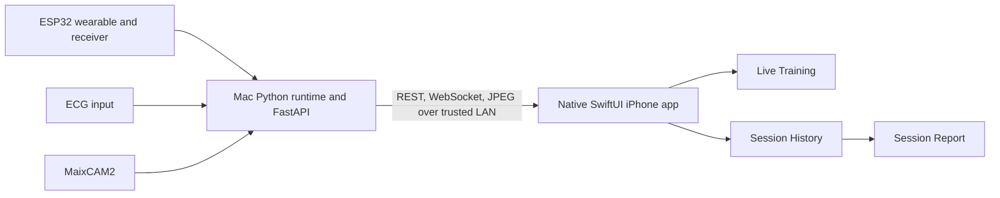

# LiteRehab Native iPhone App Design

**Date:** 2026-07-20

**Status:** Approved in conversation; awaiting written-spec review

**Target:** iPhone, portrait orientation, iOS 17 or later

**Distribution:** Direct installation from Xcode for classroom demonstration

## Objective

Create a real, installable LiteRehab iPhone application with a native SwiftUI interface. The first release keeps the existing Mac, Python, ESP32, ECG, MaixCAM2, MediaPipe, and model-inference pipeline. The iPhone becomes the primary user interface and connects to the Mac over the same trusted Wi-Fi network.

The native app must preserve the three existing product experiences:

1. Live Training
2. Session History
3. Session Report

The app remains an engineering classroom prototype. It is not a medical device and must not present its measurements as diagnosis, treatment advice, a prescription, or a clinically validated rehabilitation score.

## Current System Context

The existing product has:

- a React and Vite frontend;
- a FastAPI application serving REST endpoints, a live WebSocket, and an MJPEG camera stream;
- a Python runtime that combines wearable IMU, ECG, pose, and optional model outputs;
- locally stored session CSV files and derived reports;
- ESP32 wearable and receiver firmware; and
- a MaixCAM2 RTSP or UVC video source.

The Python runtime and hardware pipeline remain the source of truth. The native app does not duplicate inference, session calculations, or hardware control logic.

## Requirements Confirmed with the User

- The first release targets iPhone rather than iPad or Mac.
- It is installed on a few team members' iPhones through Xcode and is not submitted to the App Store.
- The Mac may remain active as the local backend and compute host.
- The Mac and iPhones can share the same Wi-Fi network or phone hotspot.
- The interface is English only.
- The app is portrait-first.
- The app includes Live Training, Session History, and Session Report.
- Pairing uses a QR code shown by the Mac, with manual reconnection available in Settings.
- The team expects iOS 17 or later on all demonstration devices.

## Approaches Considered

### React with Capacitor

This approach would reuse most of the existing React frontend and package it in a native iOS container. It is the lowest-effort route, but it does not provide the same native SwiftUI structure or long-term path to direct CoreBluetooth and Apple-platform integration.

### React Native

This approach would preserve TypeScript and some data logic while rebuilding the interface with native controls. It still requires a new mobile UI and introduces a second React platform stack.

### SwiftUI with Stanford Spezi — selected

The selected approach starts from the MIT-licensed Stanford Spezi Template Application and uses a small, deliberate subset of Spezi modules. It provides a credible native digital-health structure, reusable state and validation views, and a future path toward direct Bluetooth device integration. LiteRehab-specific live training, history, report, and networking code remains owned by this repository.

## Open-Source References and Reuse Policy

The implementation may reuse or adapt code from the following projects when it materially reduces work:

- [Stanford Spezi Template Application](https://github.com/StanfordSpezi/SpeziTemplateApplication): Xcode project structure, application lifecycle, settings conventions, tests, and SwiftUI composition.
- [Stanford SpeziViews](https://github.com/StanfordSpezi/SpeziViews): reusable view state, validation, loading, and error presentation.
- [Stanford HealthGPT](https://github.com/StanfordBDHG/HealthGPT): local-network service patterns and health-app settings conventions.
- [Apple CareKit](https://github.com/carekit-apple/CareKit): visual reference for health cards, progress, charts, and information hierarchy.
- [Stanford SpeziBluetooth](https://github.com/StanfordSpezi/SpeziBluetooth): future direct BLE integration, not a first-release dependency unless needed by the template.

MIT and BSD license notices for incorporated code or packages must be retained in an in-app Acknowledgements screen and in the repository. Apple, Stanford, Spezi, CareKit, and third-party names or marks must not be presented as endorsing LiteRehab. Screens should be adapted to LiteRehab's requirements and branding rather than copied with upstream product identity.

## High-Level Architecture



### Mac responsibilities

- hardware connections;
- video acquisition and pose processing;
- IMU and optional multimodal inference;
- ECG acquisition and demo alerts;
- session recording and CSV ownership;
- session summary and report calculation;
- authenticated local API and QR pairing information.

### iPhone responsibilities

- pairing with a Mac;
- presenting live state and annotated camera frames;
- sending start, stop, baseline, and range-reset commands;
- listing sessions and displaying reports;
- presenting connection, stale-data, and hardware-degraded states; and
- retaining only non-sensitive connection configuration.

## Native App Structure

The native application lives in a new top-level `ios/` directory. It uses one Xcode project, one application target, one unit-test target, and one UI-test target.

The application is divided into bounded features:

- `App`: lifecycle, dependency construction, root routing, and global appearance.
- `Pairing`: QR scanning, endpoint validation, connection persistence, and Settings reconnection.
- `Networking`: REST client, WebSocket client, camera-frame client, authorization, retry policy, and Codable API models.
- `Live`: current snapshot state, camera frame, ECG trace, session controls, and device status.
- `History`: session loading, search, exercise filtering, summary cards, and refresh.
- `Report`: report loading, metrics, Swift Charts, data-quality notes, and shareable PDF output.
- `DesignSystem`: LiteRehab colors, spacing, typography, cards, status badges, buttons, and reusable states.
- `Acknowledgements`: open-source licenses and engineering-prototype disclaimer.

Features communicate through protocols. Views do not construct network clients or parse transport data directly. Preview and test fixtures implement the same protocols as production services.

## Navigation and App Shell

After a valid Mac connection is configured, the app opens a native `TabView` with:

- **Live** — the default tab;
- **History** — recorded sessions.

Session Report is pushed from History through a `NavigationStack`. Settings is opened from the toolbar and contains connection status, rescan, manual address fallback, acknowledgements, and prototype information.

The app supports portrait orientation only for the first release. It respects the safe area, Dynamic Type, VoiceOver labels, reduced-motion preferences, and at least 44-point interactive targets.

## Pairing and Local-Network Security

### QR payload

When the Mac server starts for iPhone access, it prints and displays a QR code containing a versioned payload such as:

```json
{
  "version": 1,
  "name": "LiteRehab Mac",
  "base_url": "http://192.168.1.23:8000",
  "pairing_token": "opaque-random-token"
}
```

The Mac startup process generates this payload directly from its local configuration and renders it in the terminal or a small local pairing page. No unauthenticated remote API returns the token. The iPhone validates the payload version, URL scheme, private or local network host, valid port, and non-empty token before saving it.

### Authentication

- The Mac creates a cryptographically random local pairing token and stores it in a local configuration file outside recorded session CSV files.
- REST requests send the token in an authorization header.
- WebSocket and camera requests use an authenticated mechanism compatible with their clients; the token must not be written to application logs.
- The backend rejects missing or invalid tokens.
- The server binds to the requested LAN interface only when mobile access is explicitly enabled. The existing default remains loopback-only for normal desktop use.
- The iOS target includes a clear local-network usage description. Its App Transport Security configuration permits only the local-network HTTP connection required by the classroom backend; it does not enable unrestricted arbitrary HTTP access.

### Persistence

The app stores the endpoint name and address in `UserDefaults`. The token is stored in Keychain. Clearing the connection removes both values. Session and ECG data remain on the Mac.

This is local classroom security, not an internet-facing deployment design. The documentation must state that the mobile server should only be enabled on a trusted network.

## API and Backend Changes

Existing API data shapes remain the contract wherever possible.

### Reused endpoints

- `GET /api/status`
- `GET /api/sessions`
- `GET /api/sessions/{session_id}`
- `POST /api/session/start`
- `POST /api/session/stop`
- `POST /api/session/baseline`
- `POST /api/session/range/reset`
- `WS /api/live`

### New or adjusted endpoints

- `GET /api/camera.jpg` returns the newest annotated JPEG frame with no caching. The app requests frames at a bounded rate instead of relying on MJPEG behavior in a mobile web view.
- `GET /api/mobile/health` returns a small authenticated compatibility response containing API version and service identity. The app calls it immediately after scanning.

The existing web frontend continues to use relative `/api` URLs. Mobile configuration is additive and must not break loopback desktop use, fixture mode, or existing tests.

## Data Flow

### Pairing

1. The Mac starts mobile mode, determines its LAN address, and shows a QR code.
2. The iPhone scans and validates the payload.
3. The app calls the compatibility endpoint with the pairing token.
4. On success, the endpoint and token are saved and the app opens Live.
5. On failure, the app explains whether the QR is invalid, the Mac is unreachable, authentication failed, or the API is incompatible.

### Live state

1. The app opens the authenticated WebSocket.
2. Each JSON message decodes to `LiveSnapshot` on a background task.
3. The observable live store publishes UI updates on the main actor.
4. A separate bounded camera task requests the latest JPEG only while Live is visible.
5. ECG samples in each snapshot are drawn with SwiftUI Canvas or Swift Charts, selected after performance testing.

### Session commands

1. The user enters a participant ID.
2. Local validation requires a non-empty value and preserves the backend's 64-character limit.
3. Start, stop, baseline, and reset operations are serialized to prevent duplicate commands.
4. The UI waits for the backend response and subsequent live snapshot before presenting the new state.

### History and report

1. History fetches session summaries when it appears and on pull-to-refresh.
2. Search and exercise filtering happen locally over the fetched summary list.
3. Selecting a session pushes Report and fetches that session by its encoded identifier.
4. Report values and warnings are rendered without recalculating clinical or engineering metrics on the phone.

## Page Design

### Pairing

- Native LiteRehab welcome screen with a concise explanation that a Mac must be running.
- Primary **Scan Mac QR Code** button.
- Camera-permission guidance and a Settings link after permission denial.
- Manual address and token entry available as a secondary fallback in Settings, not the primary path.
- Clear connecting, connected, invalid QR, incompatible server, and unreachable states.

### Live Training

The portrait screen is ordered by immediate training importance:

1. title and compact Serial, Camera, and Fusion status badges;
2. 16:9 annotated camera card;
3. prominent movement-feedback banner;
4. primary repetition count;
5. two-column ROM, exercise, affected-side, and model-status metrics;
6. ECG card with connected state, BPM, demonstration label, and scrolling trace;
7. baseline and range-reset secondary actions; and
8. a safe-area anchored Start or Stop Session control.

Start opens a native sheet for Participant ID rather than crowding the live header. Stop requires native confirmation. When the camera is unavailable, its card displays a placeholder while IMU and ECG continue.

### Session History

The desktop table becomes a vertically scrolling list of native session cards. The page contains:

- a compact overview of total sessions, repetitions, and average duration;
- Participant ID or session ID search;
- exercise filtering;
- pull-to-refresh;
- session cards showing participant, date, exercise, duration, repetitions, good-form percentage, and data-quality status; and
- a disclosure indicator that opens the report.

Loading, empty, filtered-empty, disconnected, and failure states are distinct.

### Session Report

The report contains:

- participant title and session metadata;
- four metric cards for repetitions, good-form events, maximum observed ROM, and average connected BPM;
- native line charts for repetition, ROM, and BPM series;
- quality-event counts;
- serial, pose, and ECG completeness;
- warnings and data-quality notes;
- a share action that generates a classroom report PDF using native PDF rendering; and
- the engineering-prototype and non-medical disclaimer.

The report does not invent values when data is unavailable. Missing values use explicit labels such as **Not available** or **Not recorded**.

## Visual System

- Use native system typography with Dynamic Type rather than bundling the web font.
- Use semantic system backgrounds so light and dark appearance remain legible; dark mode support is allowed but not required for the first classroom acceptance test.
- Retain teal as the primary LiteRehab accent, with system red, orange, and green for danger, attention, and success.
- Use tabular digits for BPM, repetitions, ROM, duration, and timestamps.
- Use CareKit as an information-hierarchy reference, but avoid copying its branding.
- Use SF Symbols for native icon consistency.
- Keep animation subtle and disable non-essential animation when Reduce Motion is enabled.

## Error Handling and Recovery

- WebSocket disconnection changes the global state to **Reconnecting**, retains the last snapshot as visibly stale, disables state-changing commands, and retries with bounded exponential backoff.
- Successful foreground return triggers an immediate health check and live reconnection.
- Authentication failure stops automatic retries and asks the user to rescan.
- API incompatibility shows the server and app API versions and asks the user to update the mismatched component.
- Camera errors affect only the camera card.
- Invalid JSON or one malformed live message is recorded without crashing the stream; repeated decode failures transition to an incompatible-data error.
- Start and stop conflicts display the backend message and refresh live state.
- History and Report provide Retry without discarding the saved pairing.
- The token, raw ECG samples, and participant identifiers are excluded from routine diagnostic logs.

## Testing Strategy

### iOS unit tests

- Codable parity for live snapshots, session summaries, reports, and API errors.
- QR payload validation and rejection cases.
- Local-network permission and scoped transport configuration are present in the built target.
- Keychain-backed connection persistence through a test abstraction.
- REST request construction and authentication.
- WebSocket state transitions, stale state, retry, and cancellation.
- History filtering and report missing-data formatting.
- PDF report generation returns a valid, non-empty PDF.

### iOS UI tests

- first-launch pairing flow with injected fixture connection;
- tab navigation;
- start and stop confirmation;
- camera-unavailable and reconnecting states;
- history search and filtering;
- report navigation and share action; and
- acknowledgements accessibility.

### Backend tests

- loopback remains the default host;
- mobile mode requires a valid token;
- QR payload uses the selected LAN address and configured port;
- camera snapshot endpoint returns the latest JPEG and appropriate unavailable status;
- existing REST, WebSocket, fixture, web frontend, and session-repository tests continue to pass.

### End-to-end verification

1. Build and run the Mac backend in fixture mode.
2. Pair an iOS Simulator through injected fixture configuration and verify all screens.
3. Start the real hardware runtime on a trusted Wi-Fi network.
4. Scan the Mac QR code with a physical iPhone.
5. Verify live state, camera, ECG, start, baseline, range reset, stop, history, report, and PDF sharing.
6. Disconnect and reconnect Wi-Fi and verify recovery.
7. Build and install on each demonstration iPhone using its Xcode Personal Team provisioning.

## Acceptance Criteria

- The repository contains a native SwiftUI Xcode project targeting iOS 17 or later.
- The app installs and launches on a physical iPhone through Xcode.
- The first-run QR flow connects to a Mac on the same trusted network.
- Invalid or unreachable QR payloads produce actionable English error messages.
- Live displays camera, feedback, repetitions, ROM, exercise, side, device states, BPM, and ECG when supplied by the backend.
- Start, stop, baseline, and range reset commands reach the existing Python runtime without duplicate execution.
- Live disconnection never leaves enabled controls that appear safe to use.
- History shows all current session-summary fields in a mobile card layout and supports search and exercise filtering.
- Report shows all current report metrics, series, warnings, and completeness values and can share a generated PDF.
- The original desktop web app continues to build and operate.
- Existing Python and frontend tests pass; new backend and iOS tests pass.
- The app includes the classroom/non-medical disclaimer and required open-source acknowledgements.
- No App Store, cloud account, cloud database, HealthKit, direct ESP32-to-iPhone BLE, or on-device model inference is required for the first release.

## Explicitly Out of Scope

- App Store or TestFlight distribution;
- iPad-specific layouts;
- Android support;
- user accounts or cloud synchronization;
- patient-identifying clinical workflows;
- HealthKit integration;
- direct iPhone connection to the ESP32 or MaixCAM2;
- replacing the Python models with Core ML; and
- clinical validation or medical-device claims.
