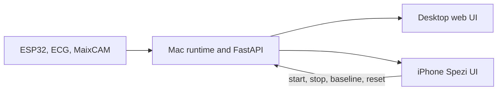

# LiteRehab iPhone Spezi Session-Flow Redesign

**Date:** 2026-07-22

**Status:** Approved in conversation; awaiting written-spec review

**Target:** Existing native iPhone app, portrait, iOS 17 or later

## Objective

Refine the existing LiteRehab iPhone app so that it resembles a realistic supervised rehabilitation workflow without moving inference, sensor acquisition, or session ownership away from the Mac. The redesign applies only to the iPhone app. The existing desktop web interface and Python runtime remain functionally unchanged and continue to share session state with the phone.

The finished experience should guide a user through connection, readiness checks, calibration, live training, and a concise completion summary. It should look and behave like a coherent member of the Stanford Spezi app ecosystem rather than a collection of custom dashboard cards.

## Upstream UI Baseline and License

The sole upstream application baseline is:

- Repository: [StanfordSpezi/SpeziTemplateApplication](https://github.com/StanfordSpezi/SpeziTemplateApplication)
- Reference commit: `d52014a54cbfe68ef1f1c364e81a97edecf5e4a8`
- License: MIT

LiteRehab may reuse and adapt the upstream SwiftUI composition, onboarding layout, navigation conventions, event/task presentation, state alerts, settings conventions, and license presentation. Reused source must retain the upstream copyright and SPDX headers where a substantial source file or component is incorporated.

The redesign must not retain Stanford or Spezi product identity, imply endorsement, or copy upstream features that are irrelevant to LiteRehab. LiteRehab keeps its own name, icon, colors, copy, API clients, and rehabilitation-specific content. The in-app acknowledgements must name the template repository, reference commit, copyright holder, and MIT license text.

The upstream `main` branch uses APIs newer than the app's iOS 17 deployment target in some places. Equivalent iOS 17-compatible SwiftUI composition must be used where a literal API copy would raise the deployment target.

## Selected Reuse Approach

Three approaches were considered:

1. Apply only a visual skin to the current screens.
2. Reuse the Spezi template's page structure and task-flow conventions while preserving LiteRehab services and data contracts.
3. Transplant the full template application and all of its account, Firebase, HealthKit, notification, questionnaire, and scheduler dependencies.

Approach 2 is selected. It provides recognizable upstream composition and consistent interaction patterns without importing unrelated infrastructure or risking the already verified local-network and hardware pipeline.

## Scope

### Included

- Spezi-style pairing onboarding.
- A guided session flow with preflight, countdown, active, and completed states.
- Clear separation between patient-facing feedback and technical status.
- Haptic feedback for meaningful feedback changes.
- Connection-loss and recovery presentation.
- Bounded camera retry behavior.
- Immediate completion summary based on values observed during the live session.
- Existing History, Report, Settings, pairing, REST, WebSocket, PDF, and Keychain behavior restyled to the same visual system.
- Unit tests, UI tests, accessibility checks, and simulator screenshot inspection.

### Excluded

- Changes to the desktop web UI.
- Moving IMU, pose, ECG, repetition, or model inference to the iPhone.
- Direct iPhone-to-ESP32 Bluetooth.
- HealthKit, Firebase, user accounts, cloud sync, questionnaires, or notifications.
- App Store distribution.
- Clinical claims or medical-device language.

## Information Architecture

The connected app keeps two top-level tabs:

- **Live**: the guided rehabilitation task and current session.
- **History**: recorded sessions and navigation to reports.

Settings remains a toolbar destination. Session Report remains a navigation destination from History. This preserves current user expectations and API ownership while adopting the template's native navigation and task hierarchy.

## Pairing Experience

The current pairing functionality is retained but presented using the Spezi onboarding composition:

- prominent LiteRehab title and concise subtitle;
- three information areas explaining Mac connection, trusted local network, and secure QR pairing;
- a single full-width primary action to scan the QR code;
- manual-code entry as a secondary disclosure;
- `ViewState` processing and error presentation;
- a clear local-network troubleshooting message when the Mac is unreachable.

Successful saved connections continue to bypass onboarding. An invalid or cleared connection returns the user to pairing without losing Mac-owned session data.

## Guided Session State Model

The Live feature introduces an explicit state machine:

```swift
enum SessionFlowState: Equatable {
    case preflight
    case countdown(remaining: Int)
    case active
    case completed(SessionCompletion)
}
```

The state machine is owned by `LiveStore` or a focused child coordinator. Views render state and dispatch intentions; they do not call network clients directly.

### Preflight

Preflight resembles an upstream task or event detail rather than a dense dashboard. It contains:

- Participant ID field;
- compact readiness rows;
- one primary start action;
- a secondary degraded-mode confirmation when optional inputs are unavailable.

Hard requirements:

- authenticated Mac connection;
- non-empty Participant ID within the existing 64-character limit;
- available ESP32 serial input.

Soft requirements:

- camera;
- ECG;
- ML checkpoint.

When a soft requirement is unavailable, the row explains the resulting mode, such as IMU-only or rule fallback. The main action becomes `Start Anyway` after the user acknowledges the degraded state. This prevents nonessential hardware from blocking a classroom demonstration while preserving transparency.

### Countdown and Baseline

Starting a session performs this ordered sequence:

1. Freeze the validated Participant ID.
2. Present `Stand still` and a visible `3`, `2`, `1` countdown.
3. Trigger one light haptic per count when haptics are enabled.
4. Call `recaptureBaseline()` after the countdown.
5. Call `startSession(subject:)` only after baseline succeeds.
6. Transition to `active` when the command succeeds.

An error during baseline or start returns to preflight with an actionable Spezi-style alert. It must not leave the UI claiming that recording began.

### Active Training

The active screen prioritizes patient-facing information:

- current repetition count in the largest type;
- current exercise and feedback;
- ROM and BPM as secondary metrics;
- annotated camera frame when available;
- connection and hardware state in a compact, collapsible technical section;
- one unambiguous destructive-style stop action.

Feedback uses short English copy and semantic colors:

- `Good movement`
- `Move slower`
- `Increase your range`
- `Keep your body still`

The existing backend feedback remains the source of truth. The iPhone maps backend strings to presentation copy without inventing new rehabilitation calculations.

### Haptics

Haptics occur only when the normalized feedback category changes. Repeated snapshots with the same category do not retrigger feedback. A minimum interval prevents rapid alternation from producing continuous vibration. Reduced-motion and accessibility preferences remain respected; haptics never replace visible text.

### Completion

Stopping performs one serialized `stopSession()` request. On success, the iPhone presents a Spezi-style completion view containing values observed locally during the active session:

- duration;
- final repetition count;
- maximum observed ROM;
- most recent valid BPM;
- dominant or final feedback summary when available.

The completion view does not recalculate full report statistics. It offers `View History` for the authoritative Mac-generated report and `Done` to return to preflight. If the report has not appeared yet, History retains its existing loading and refresh behavior.

## Synchronization and Data Ownership

The Mac remains the single source of truth. The desktop browser and iPhone continue to consume the same runtime and API:



The iPhone's state machine describes its presentation, not a second recording engine. Live WebSocket snapshots reconcile command results and keep the phone synchronized with commands issued from the desktop. If a snapshot reports that recording started or stopped externally, the phone updates its flow state accordingly.

## Connection and Camera Resilience

WebSocket reconnection keeps the current exponential backoff and gains an inline Spezi-style reconnecting state. The active screen remains visible during a transient interruption and marks data as stale. On recovery, current server state replaces stale values.

Camera polling changes from a fixed 125-millisecond retry loop to bounded adaptive behavior:

- normal successful frame interval remains bounded for a responsive preview;
- transient failures increase the delay;
- repeated failures show one stable unavailable state instead of updating the error on every request;
- a successful frame resets the retry delay;
- polling stops whenever Live is not visible.

Camera failure never terminates the live WebSocket or the session.

## Visual System

The redesign follows the template's restrained native hierarchy:

- standard SwiftUI navigation titles and toolbars;
- system typography with Dynamic Type;
- grouped task sections rather than dashboard-style gradients;
- SF Symbols with consistent semantic meaning;
- one primary action per state;
- native materials, separators, and content-unavailable states;
- SpeziViews loading and alert states;
- minimum 44-point controls and complete VoiceOver labels.

Custom gradients and ornamental cards are removed where the template does not require them. LiteRehab's indigo accent remains, but the app does not introduce custom branding that conflicts with standard system controls.

## Components and Boundaries

New or revised components should remain small and focused:

- `SessionFlowState`: pure flow state and transitions.
- `SessionCompletion`: locally observed completion values.
- `PreflightView`: participant and readiness presentation.
- `SessionCountdownView`: countdown-only presentation.
- `ActiveTrainingView`: patient-facing live state.
- `SessionCompletionView`: immediate post-session summary.
- `HardwareReadiness`: pure mapping from `LiveSnapshot` to hard and soft checks.
- `FeedbackPresentation`: pure backend-feedback normalization, display copy, semantic color, and haptic category.

Networking, decoding, Keychain storage, and API models remain outside views. Existing protocols continue to support fixtures and tests.

## Error Handling

- Invalid Participant ID: inline validation before countdown.
- Missing hard requirement: disabled primary action with an explanation.
- Missing soft requirement: explicit degraded-mode acknowledgement.
- Baseline or start failure: return to preflight and show one actionable alert.
- Stop failure: remain active and allow retry.
- Pairing expiration: route back to pairing after explaining that a new QR is required.
- Temporary network loss: remain on the current screen and reconnect automatically.
- Camera loss: preserve training state and show a stable camera placeholder.

## Testing

### Pure and unit tests

- readiness mapping for healthy and degraded snapshots;
- Participant ID validation;
- state transitions through preflight, countdown, active, and completed;
- baseline-before-start ordering;
- prevention of duplicate commands;
- completion metric accumulation;
- feedback normalization and haptic throttling;
- camera retry progression and recovery;
- reconciliation when recording changes from another client.

### UI tests

- Spezi-style pairing entry;
- healthy preflight start;
- degraded-mode confirmation;
- countdown labels;
- active training hierarchy;
- stop and completion summary;
- History and Settings navigation;
- reconnecting and camera-unavailable states.

### Verification

- existing Swift core, iOS unit, iOS UI, Python, web, and firmware tests remain green;
- simulator screenshots are inspected at representative portrait sizes, light mode, dark mode, and large Dynamic Type;
- a physical iPhone validates QR pairing, start/countdown/stop, haptics, desktop synchronization, and reconnection;
- copied or substantially adapted upstream files retain the MIT notice and appear in Acknowledgements.

## Acceptance Criteria

The redesign is complete when:

1. The connected iPhone app follows the Spezi template's onboarding, navigation, task, state, and settings conventions.
2. A user can complete pairing, preflight, countdown, live training, stop, completion, history, and report without encountering a dashboard-like or inconsistent screen.
3. Hard and soft hardware requirements behave as specified.
4. Countdown captures baseline before recording begins.
5. Desktop and iPhone remain synchronized through the existing Mac source of truth.
6. Connection and camera failures are understandable and do not flood the interface or server.
7. The app remains compatible with iOS 17+, English-only, portrait-first, and directly installable through Xcode.
8. The upstream reference, commit, copyright, and MIT license are retained.
9. The app continues to state that it is an engineering prototype and not a medical device.
